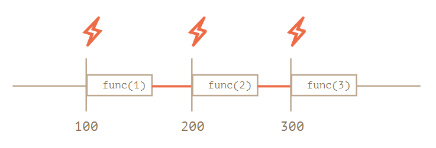
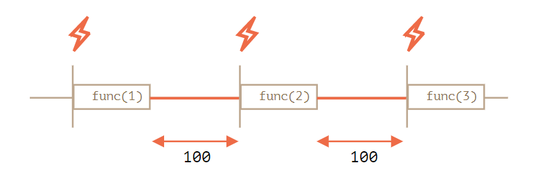
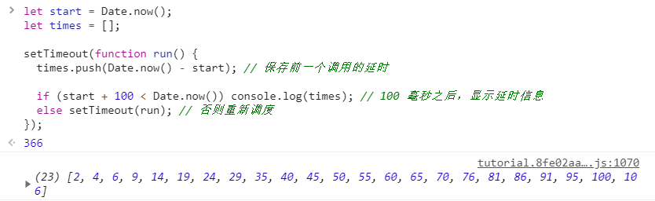
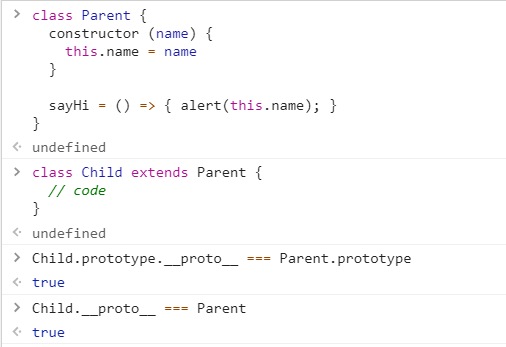
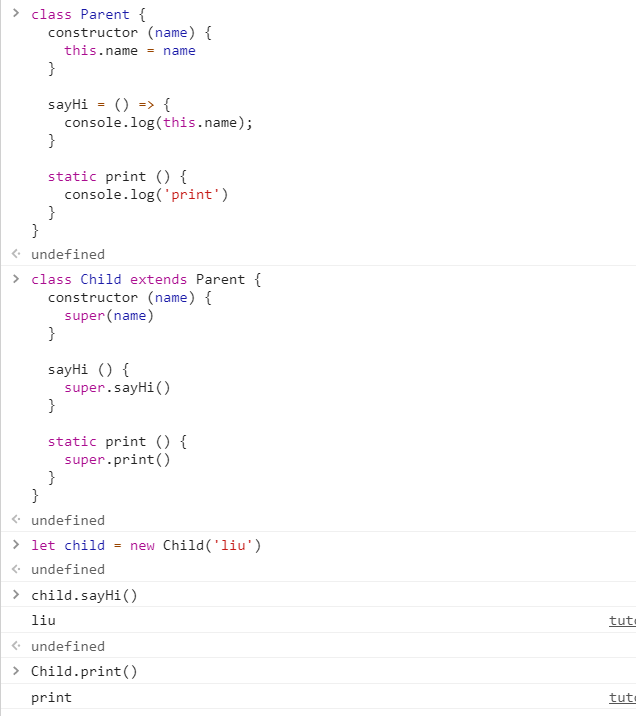
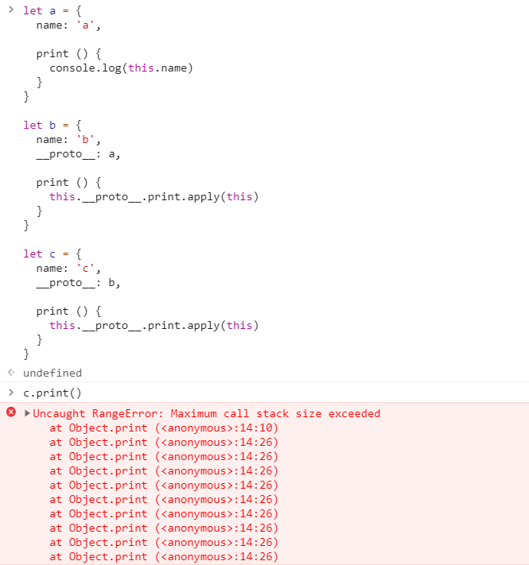

## 数据

### 字符串

1.我们都知道在`ES6`中新增了反引号用来表示多行字符串，除了在内部使用`${}`将任何表达式嵌入字符串中的用法，反引号实际上还支持模板函数，通过在第一个反引号前指定函数名，该函数就会被自动调用并传入模板字符串作为参数
```
function print(str, val) {
  console.log(str.join(' ') + val)
}

print`Hello${1}World` // 'Hello World1'
```

2.常见的操作字符串的方式
```
let str = 'abcd'

str.length // 4

str[0] // 'a'

str.charAt(1) // 'b'

for (let s of str) console.log(s) // 'a', 'b', 'c', 'd'

```

3.字符串虽然和数组类似，比如可通过`length`获取长度，可遍历，但我们要注意字符串本身是不可变的，单纯的改变字符串中某个位置的值没有效果，如果我们确实需要修改字符串，好的做法是把处理的结果存放到一个新建的字符串变量中
```
let str = 'Hello'

str[0] = 'h'

console.log(str) // 'Hello'

let str2 = 'h' + str.slice(1) // 'hello'
```

4.对于字符串查找，我们通常使用`indexOf`方法，找不到的情况该方法会返回`-1`，无法直接在判断语句中使用，这里介绍一种技巧`按位NOT`，`~`运算符会将数字转为32位整数并对其二进制位中的所有位取反，通俗一点就是`~n === -(n + 1)`，利用这点我们可以优化字符串的查找判断
```
let str = 'abcd'

if (~str.indexOf('a')) {
  // find out
}
```

5.所有的字符串都使用`UTF-16`编码，每个字符都有对应的数字编码，通过特殊的方法我们可以实现数字代码到字符的相互转化
```
let str = '1234'

console.log(str.codePointAt(0)) // 49

String.fromCodePoint(49) // '1'
```

实际上我们原来也有`str.charCodeAt`和`String.fromCharPoint`两个方法，定义新的方法是为了处理代理对（所谓代理对就是一些稀有字符无法用2字节表示，而是使用一对2字节的符号编码），老的方法由于代理对在JS创建时并不存在，所以无法正确处理
```
let str = '𝒳'

console.log(str.length) // 2

str.charCodeAt(0) // 55349

String.fromCharCode(55349) // '�'

// 正确的处理

str.codePointAt(0) // 119987

str.codePointAt(1) // 56499，和老的方法一样取代理对的后一个字节的数字编码

String.fromCodePoint(119987) // '𝒳'
```

6.字符串中有一些字符含有音标，和原字符不同，这些变音符号允许使用多个`unicode`字符表示（当然一些常见的变音字符也可以拥有单字符的数字编码），这带来一些表示和比较上的问题，所幸后来我们定义了一些方法对其进行处理
```
let str1 = 'S\u0307\u0323' // Ṩ
let str2 = 'S\u0323\u0307' // Ṩ

str1 === str2 // false

str1.normalize() === str2.normalize() // true， '\u1e68'

'Ö' > 'Z' // true
'Ö'.localeCompare('Z') // -1，代表'Ö'小于'Z'，这符合直觉
```

### 变量

1.`var`、`let`、`const`的区别

- `var`没有块级作用域，不是函数作用域就是全局作用域
- `var`允许重复声明
- `var`声明的变量可以在其声明语句前被使用

```
// 神奇的情况

if (0) {
  var a = 1 // 这里的逻辑理论上永远不会执行，但a还是被声明了
}

console.log(a) // undefined
```

在旧时代，我们对块级作用域的`hack`是`IIFE`立即执行函数，随着`let`和`const`的面世，它的作用已经越来越小了

### 数据类型

1.`null`和`undefined`的各种表现

在`==`中`null`和`undefined`不能转为其他类型，所以我们看到下面的结果
```
null == undefined // true

null == 0 // false

null == '' // false

undefined == 0 // false

undefined == '' // false
```

在运算符中，`null`被视为`0`，而`undefined`被视为`NaN`
```
1 - null // 1

null >=0 // true

undefined + 1 // NaN

undefined >= 0 // false

```

2.`NaN`的各种表现

`NaN`不等于自身，只能通过`isNaN`判断一个值是否是非数字
```
NaN == NaN // false

isNaN('a') // true
```

`NaN`与其他数据做加减乘除均得到`NaN`，`NaN`与其他数据比较均得到`false`
```
1 + NaN // NaN

1 * NaN // NaN

NaN >= 0 // false

NaN < -1 // false
```

### 数字类型

1.我们可以把一些长数字通过简写来避免写一长串的0，不仅是因为懒，更多的是出于避免错误的考虑
```
10000 === 1e4
10000 === 10e3

10007 === 1e4+7

0.001 == 1e-3 // 3表示除1外0的数量
```

2.一般数字在JS中有多种进制的表示，比如说当需要按位操作时我们用二进制表示；颜色代码我们用16进制表示，`toString()`方法接收参数`base`，指定转化为哪种进制的表示字符串
```
let num = 255

num.toString(2) // '11111111'

num.toString(8) // '377'

num.toString(16) // 'ff'
```

当然我们所熟知的还有`parseInt`方法，该方法接收第二个参数表示用什么基数来解析传入的字符串
```
parseInt('10') // 10

parseInt('11111111', 2) // 255

parseInt('377', 8) // 255

parseInt('ff', 16) // 255

parseInt('0xff', 16) // 255，parseInt方法内部对16进制做了特殊处理使得其能够识别0x前缀
```

3.数字的舍入方式总结

`Math`数学方法库的四个常用方法`round`、`floor`、`ceil`、`trunc`
```
Math.round(1.5) // 2，四舍五入
Math.floor(1.5) // 1，向下舍入
Math.ceil(1.5) // 2，向上舍入
Math.trunc(1.5) // 1，移除小数点后的内容
```

一些操作会把小数先转化成整数再处理，比如说位运算符，这些位运算符会直接丢弃掉小数后面的部分
```
4.9 >> 1 // 2
3.9 >> 1 // 1
```

4.保留小数

用的最多的是`toFixed`方法，它把数字保留指定位数（四舍五入）的小数并转成字符串返回
```
'1.2252'.toFixed(2) // '1.23'
```

我们也可以用乘除法模拟
```
let num = 1.23456

console.log(Math.floor(num * 100) / 100) // 1.23
```

此外还有`toPrecision`和`toExponential`方法
```
let num = 1.23456

console.log(num.toPrecision(4)) // 1.235
console.log(num.toExponential(3)) // 1.235e+0
```

5.小数的不精确性，就好像我们在十进制中无法表示`1/3`这种无限循环小数一样，在计算机中，我们也无法表示诸如`0.1`、`0.2`这样的小数
```
0.1 + 0.2 === 0.3 // false

console.log(0.1 + 0.2) // 0.30000000000000004
```

通过`toFixed`方法我们可以看到精度的损失，在运算中这个损失会累加
```
0.1.toFixed(20) // '0.10000000000000000555'

0.2.toFixed(20) // '0.20000000000000001110'
```

所以我们要避免对小数进行比较，或者把小数的运算转化为整数的运算，避免精度的损失

6.处理数字判断的历史问题`Object.is`，我们原来是无法区分`NaN`和正负0的，使用该方法可以得到正确的结果
```
NaN === NaN // false

0 === -0 // true

Object.is(NaN, NaN) // true
Object.is(0, -0) // false
```

7.奇葩问题，为啥`6.35.toFixed(1) == 6.3`，这个就是一个典型的精度损失的问题，我们把`6.35`打印出来就一目了然了
```
6.35.toFixed(1) == 6.3 // true

console.log(6.35.toFixed(20)) // 6.34999999999999964473
```

8.生成从`min`到`max`的随机整数，由于四舍五入的存在，我们得到的整数的概率是不一样的，比如下面这个例子
```
function random (min, max) {
  return Math.round(min + (max - min) * Math.random())
}

random(1, 3)

得到1的值的范围是`1-1.4999999...`
得到2的值的范围是`1.5-2.4999999...`
得到3的值的范围是`2.5-3`

所以得到2的概率是其他两个值的两倍
```

我们可以采用取`min - 0.5 ~ max + 0.5`的方法
```
function random (min, max) {
  return Math.round((min - 0.5) + (max - min + 1) * Math.random())
}
```

也可以采用`Math.floor`的方式取`min ~ max + 1`的范围
```
function random (min, max) {
  return Math.floor(min + (max - min + 1) * Math.random())
}
```

### 类型检测

除了`typeof`和`instanceof`之外，我们还介绍过`Object.prototype.toString`方法来检查数据类型，但这里我们扩展一下，`toString`方法实际上会查找目标对象的`Symbol.toStringTag`属性，拿到其值作为`toString`的返回值
```
let obj = {
  [Symbol.toStringTag]: 'User'
}

obj.toString() // '[object User]'
```

## 运算

### 值的比较

1.字符串之间的比较是按顺序比较每一位的数字编码，直到比较出结果或者一方没有可比较的字符
```
'abcd' > 'abcc' // true

'abcd' > 'b' // false

'abcd' > 'abc' // true

'abcd' === 'abcd' // true
```

### 运算符

1.运算符的优先级

- 乘除优先级高于加减
- 括号优先级最高
- 一元运算符高于二元运算符

2.我们知道`=`有赋值功能，但我们经常会忽略它的另一个作用，返回赋值的结果
```
let a = 0

let c = 3 - (a = 2 + 1) // 0
```

`=`运算符还支持链式操作，使得多个变量共享同一个值
```
let a, b, c

a = b = c = 0
```

3.自增/自减操作有前置和后置两种形式，它们之间的区别是返回值的不同
```
let a = 2

a++ // 2，先返回再自增
++a // 4，先自增再返回
```

4.逗号运算符我们使用的很少，但一些情况会使用它写更简短的代码，所以有必要了解一下它的规则，对于用逗号连接的表达式或语句，我们会执行每一条表达式或语句，但最终只返回最后一次计算的值
```
1, 2 // 2

let a = (1 + 2, 3 + 4)

console.log(a) // 7

```

逗号运算符的优先级很低，甚至比`=`还要低，所以圆括号是很有必要的
```
let a = 1, 2

console.log(a) // 1
```

### 逻辑运算符

1.`||`运算符在JS中和我们接触到的传统编程语言有些许不同，它会去查找以`||`运算符连接的各个表达式的值，找到第一个出现的真值并返回，如果没有找到，返回最后一个值，虽然在`||`运算符判断时内部会进行布尔转换，但返回时只返回计算值
```
let a = null || -1 || undefined

console.log(a) // -1

1 || console.log(1) // 短路运算，永远不会执行console.log
```

2.`&&`运算符和`||`运算符类似，但它找的是第一个出现的假值
```
let a = -1 && null && 0

console.log(a) // null
```

`&&`运算符要比`||`运算符的优先级高，所以在存在这两者时，我们不必刻意加圆括号
```
let a = 1 && 2 || -1 && 10

console.log(a) // 2
```

3.容易发生误解的地方
```
if (-1 || 0) console.log('a') // 'a'，这里判断中的结果为-1

if (null || -1 && 1) console.log('b') // 'b'，这里判断中的结果为1
```

### Switch语句

1.`switch`语句的一个特点就是可取代多分支选择的`if/else`语句，`switch`语句至少要有一个`case`代码块和一个可选的`default`代码块
```
let a = 1

switch(a) {
  case 1:
    console.log('found')
    break
  default:
    console.log('not found')
    break
}
```

2.`switch`语句的逻辑时根据传入的参数匹配`case`后面的值，匹配到值后会执行后面的代码直到遇到`break`指令，这里描述的后面的代码不会再下一个`case`块停止，这意味着我们在处理每种情况时最好都加上`break`除非你明白自己在干什么
```
let a = 1

switch(a) {
  case 1:
    console.log('one')
  case 1:
    console.log('two')
    break
  default:
    console.log('not found')
    break
}

最终会输出one、two两个结果
```

### 循环

1.对于`for`循环，除了循环体我们定义了三个部分，分别是`begin`、`condition`、`step`
```
for (begin; condition; step) {
  // 循环体
}
```

我们可以省略这三个部分，得到一个无限循环`for (;;)`，要注意两个分号不能省略，否则会产生语法错误

2.标签，我们了解了`continue`和`break`可以跳出当前循环或跳过当次迭代，如果在后面跟上标签则会跳出标签指定的循环或者跳过标签指定循环的当次迭代
```
next: for(;;) {
  for (;;) {
    break next;
  }
}

console.log(1) // 1
```

## 对象

### 基本定义

1.我们在定义对象属性时有两种方式，一种是点符号，一种是方括号
```
let obj = {
  name: 'liu',
  age: 23,
}

obj.name // 'liu'

obj['name'] // 'liu'
```

点符号只能接属性名，不能跟变量
```
let n = 'name'

obj.n // undefined
```

方括号可以后跟变量名，此外，它还能引用多词语的属性
```
let obj = {
  name: 'liu',
  age: 23,
  'like things': 'apple'
}

obj['like things'] // 'apple'

let l = 'like things'
obj[l] // 'apple'
```

2.当我们需要定义一个动态`key`的属性时，我们使用计算属性
```
let sex = 'sex'

let obj = {
  name: 'liu',
  age: 23,
  [sex + ' is']: 'male',
}

obj['sex is'] // 'male'
```

3.在设置对象属性时，我们无法把`__proto__`的值设为非对象
```
let obj = {
  name: 'liu',
  age: 23,
}

obj.__proto__ = 5

alert(obj.__proto__)  // [object Object]
```

4.判断属性是否存在对象中的方法

- `in`，格式为左边是要判断的属性名，右边是操作对象，会查找原型链
- `obj.hasOwnProperty`，继承的方法，判断对象本身是否存在某个属性，不查找原型链
- 直接引用某个属性，看值是否为`undefined`，注意属性被赋值为`undefined`的情况

```
let obj = { name: 'aa' }

obj.b // undefiend

'name' in obj // true

'toString' in obj // true

obj.hasOwnProperty('toString') // false
```

5.遍历对象的方法

- `for...in`，遍历对象自身的和继承的可枚举属性（不含Symbol属性）
- `Object.keys`，遍历对象自身的可枚举属性（不含Symbol属性）
- `Object.getOwnPropertyNames`，遍历自身的所有属性（不含Symbol属性）
- `Object.getOwnPropertySymbols`，遍历自身所有的Symbol属性
- `Reflect.ownKeys`，遍历对象自身的全部属性（包含Symbol属性）


6.对象在遍历时对于属性并不都是按照定义的顺序来的，在遍历到一些可以被转化成数字的属性名时，会把它们提到前面并按从小到大的顺序遍历出来，然后再遍历其他属性
```
let obj = {
  name: 'liu',
  '0': 0,
  '1': 1,
}

Object.keys(obj) // ['0', '1', 'name']
```

### 构造函数和操作符

1.一个函数我们可以通过`new.target`属性来检查它是否被作为构造函数使用，如果是普通调用，值为`undefined`，否则指向构造函数本身
```
function Parent () {
  this.name = 'liu'

  console.log(new.target)
}

Parent() // undefined

new Parent() // 打印函数本身
```

2.构造函数一般没有`return`值，如果显式指定返回，会根据值的类型决定要不要忽略，如果是对象，就返回这个对象；如果是原始类型，就忽略
```
function Parent (ctl) {
  this.name = 'liu'

  return ctl ? {} : 1
}

new Parent() // { name: 'liu' }

new Parnet(1) // {}
```

3.对象提供了一对方法用来转换数组和对象，使得我们可以使用数组的方法处理对象然后返回一个处理后的对象
```
let obj = {
  name: 1,
  age: 2
}

Object.fromEntries(Object.entries(obj).map(([key, value]) => [key, value * 2]))

// 输出
{
  name: 2,
  age: 4
} 
```

## 数组

1.JS中数组既可以充当队列`push, shift`，也可以充当栈`pop, push`，这样的数据结构在计算机中被称为双端队列

2.JS对数组做了一些优化，比如将数组中的元素存储在连续的内存区域，但如果我们像对待常规对象一样对待数组，这些优化将被关闭，下面的几种方式都是不建议的：
```
let arr = []

// 添加非数字属性
arr.test = 'name'

// 非连续赋值
arr[0] = 1
arr[10000] = 1

// 分配的索引极大
arr[10000000000000] = 1
```

3.操作数组末端的方法要比操作数组头部的方法性能要好，这是因为操作头部数据还需要额外的重新编号

4.遍历数组的方式

- `for (let i=0; i<arr.length; i++)`循环，运行最快，兼容最好
- `forEach`，该方法会跳过数组中的空位
- `for...in`，该方法不仅会遍历数字索引，还会遍历其他定义的属性，不建议使用
- `for...of`，不获取索引，只获取每个元素的值

5.拓展，求解数组中累加和最大的连续的子数组的最大和

暴力解法，双重遍历，枚举出所有可能的子数组，求和，求最大值
```
function getMaxSubSum (arr) {
  let max = 0
  for (let i = 0; i < arr.length; i++) {
    let tmp = 0
    for (let j = i; j < arr.length; j++) {
      tmp += arr[j]
      max = Math.max(max, tmp)
    }
  }

  return max >= 0 ? max : 0
}
```

动态规划，状态转移方程为`dp[i] = max(dp[i - 1] + a[i], a[i])`
```
function getMaxSubSum (arr) {
  let n = arr.length
  let dp = [arr[0], ...Array(n - 1).fill(0)]
  let max = dp[0]

  for (let i = 1; i < n; i++) {
    dp[i] = Math.max(dp[i - 1] + arr[i], arr[i])

    max = Math.max(dp[i], max)
  }

  return max > 0 ? max : 0
}
```

考虑到我们不需要记录中间子数组的和，我们只需要维护一个变量即可
```
function getMaxSubSum (arr) {
  let max = 0
  let tmp = 0

  for (let i = 0; i < arr.length; i++) {
    tmp += arr[i]
    if (tmp < 0) tmp = 0

    max = Math.max(tmp, max)
  }

  return max
}
```

验证


## 解构赋值

1.数组的解构赋值会根据传入变量的个数，从`0`开始一一映射，如果要丢弃某个下标的值，只需要增加额外的逗号
```
let arr = [1, 2, 3, 4]

let [one, two, , four] = arr // 1, 2, 4
```

实际上解构赋值更加强大，等号左边可以是任何可以被赋值的东西，而右边可以是任何可迭代对象
```
let [a, b, c] = 'abc'

let obj = {}

let [obj.name, obj.sub] = 'hello world'.split(' ')
```

2.我们可以使用`...`来拉取解构赋值的剩余部分
```
let [a, ...rest] = 'abcd'

console.log(rest) // ['b', 'c', 'd']
```

3.我们可以给解构赋值的变量设置默认值，设置的值可以通过计算而来，只有在这个变量未被赋值的时候才会计算默认值
```
// 这里不会弹出对话框
let [name = prompt('name?'), sub = 1 + 2] = ['ll']

console.log(sub) // 3
```

4.解构赋值允许嵌套的情况
```
let obj = {
  name: {
    first: 'liu',
    second: 'xiang',
  }
}

let { name: { first, second } } = obj

console.log(first) // 'liu'
console.log(second) // 'xiang'
```

## JSON

1.JS中的对象在正常情况下比如使用`toString`是无法看清楚其内部的属性值的，因为它被转化成如下的字符串
```
({ name: 'liu' }).toString() // [object Object]
```

这不利于进行传输或者再处理，有没有方法可以将对象映射为字符串呢，就像数组的`toString`方法会自动把各个元素用`,`连接成字符串一样，答案是`JSON.stringify`
```
let obj = {
  a: {
    b: 'c'
  }
}

JSON.stringify(obj) // '{"a":{"b":"c"}}'
```

注意到属性名都被加上了双引号，我们再看看其他原始类型
```
let obj = {
  name: 'liu',
  age: 23,
  married: false,
  car: null,
  house: undefined,
  [Symbol('sex')]: 'male',
  sayHi () {
    alert('Hello')
  }
}

JSON.stringify(obj) // '{"name":"liu","age":23,"married":false,"car":null}'
```

通过上面这个例子可以看出该方法的一些规则

- 把属性名都用双引号包裹起来
- 对属性值，只把字符串格式的值用双引号包裹
- 跳过值为`undefined`和方法的属性
- 跳过`Symbol`类型的属性

2.`JSON.stringify`方法接收第二个参数用来控制转换的属性范围

传入一个属性数组
```
let obj = {
  name: 'liu',
  age: 23,
  married: false,
  car: null,
  house: undefined,
  [Symbol('sex')]: 'male',
  sayHi () {
    alert('Hello')
  }
}

JSON.stringify(obj, ['name']) // '{"name":"liu"}'
```

传入一个方法
```
let obj = {
  a: {
    b: 'c'
  },
  self: obj,
  global: {
    name: 'obj',
    value: obj,
  }
}

// 过滤循环引用
JSON.stringify(obj, function (key, val) {
  console.log(this)

  return (key === 'self' || key === 'value') ? null : val
})

// 输出 {"a":{"b":"c"},"self":null,"global":{"name":"obj","value":null}}
```

上面我们在方法中打印`this`，可以很清楚的发现该方法会在属性递归遍历时被调用，调用时的`this`指向当前属性所属对象


从结果中看出第一个调用很特殊，它的key是`""`，而值是传入的目标对象本身，这表明`stringify`方法会预处理目标对象，把它包裹到一个特殊的包装对象中，这么做的原因是让`replacer`方法有机会跳过整个对象

3.其实`stringify`方法还支持第三个参数`spaces`，用于控制显示多行时对象的空格缩进情况，主要是记录日志和美化输出
```
let obj = {
  a: {
    b: 'c'
  },
}

JSON.stringify(obj, null, 4)

// 输出
"{
    "a": {
        "b": "c"
    }
}"
```

4.对象可以自定义`toJSON`方法，这样`JSON.stringify`会优先调用它
```
let obj = {
  time: new Date()
}

JSON.stringify(obj) // '{"time":"2020-10-23T01:58:36.823Z"}'
```

这里就是调用了`Date`类实例的内置`toJSON`方法把日期变成了一个字符串，我们自定义`toJSON`方法试试
```
let obj = {
  name: 'liu',
  sub: {
    name: 'xiang',
    toJSON() {
      return 1
    }
  }
}

JSON.stringify(obj) // '{"name":"liu","sub":1}'
```

5.`parse`方法用于逆向解析`stringify`生成的`JSON`串，当然我们也可以手写，但手写容易引入错误，造成解析失败
```
let obj = {
  name: 'liu'
}

JSON.parse(JSON.stringify(obj)) // {name: 'liu'}
```

`parse`方法支持传入第二个参数，和`stringify`一样，`reviver`接收匹配到的每一对键值对
```
let str = '{"title":"Conference","date":"2017-11-30T12:00:00.000Z"}';

let meetup = JSON.parse(str); // 得到的date属性并不是`Date`类实例

meetup = JSON.parse(str, (key, val) => {
  if (key === 'date') return new Date(val)

  return val
})

meetup.date.getDate() // 30
```

6.通常我们有深拷贝需求，如果不想自己重写一个深拷贝方法的话，可以像这样实现
```
let obj = {
  name: 'liu',
  sub : {
    age: 23
  }
}

let obj2 = JSON.parse(JSON.stringify(obj))

obj2.name = 'haha'
obj2.age = 24

console.log(obj) // {name: 'liu', sub: { age: 23 }}
```

## Date

1.创建日期使用`Date`内建对象，JS内置的`Date`构造函数十分强大

不传参数，返回当前日期和时间的对象
```
let now = new Date()

console.log(now) // Fri Oct 23 2020 10:39:18 GMT+0800 (中国标准时间)
```

传入整数，该整数表示自`1970-1-1 00:00:00`以来经过的毫秒数，允许负数，会往前推
```
let Jan01_1970 = new Date(0)

console.log(Jan01_1970) // Thu Jan 01 1970 08:00:00 GMT+0800 (中国标准时间)

let Dec31_1969 = new Date(-24 * 3600 * 1000)

console.log(Dec31_1969) // Wed Dec 31 1969 08:00:00 GMT+0800 (中国标准时间)
```

传入字符串，该字符串会被自动解析，和`Date.parse`所使用的算法相同
```
let date = new Date('2010年11月12日') // Invalid Date

let date2 = new Date('2010-11-12') // Fri Nov 12 2010 08:00:00 GMT+0800 (中国标准时间)
```

传入当前时区中给定组件，只有年份和月份是必须的其他都可以省略，默认填充初始值
```
new Date(year, month, date, hour, minutes, seconds, ms)
```

年份必须是四位的，月份从`0`开始计数，某天如果缺失，则设为`1`，其他项缺失默认值为`0`
```
let date = new Date (2010, 0) // Fri Jan 01 2010 00:00:00 GMT+0800 (中国标准时间)

let date2 = new Date (2010, 0, 31, 13, 24, 1, 200) // Sun Jan 31 2010 13:24:01 GMT+0800 (中国标准时间)
```

2.获取`Date`对象中年月日的方法中有几个特殊事项

- 获取年份最好使用`getFullYear`
- 获取月份结果是从`0`开始的，这说明`0`代表1月
- 获取星期`getDay`也是从`0`开始的，但`0`代表星期天
- 获取一月中的某天使用`getDate`，该方法的方法名不够直观

3.`Date`对象会自动校准输入值，这意味着我们可以输入超出范围的值，它会自动推导出正确的日期
```
let date = new Date(2013, 0, 32) // Fri Feb 01 2013 00:00:00 GMT+0800 (中国标准时间)

date.setDate(date.getDate() + 29)

console.log(date) // Sat Mar 02 2013 00:00:00 GMT+0800 (中国标准时间)
```

4.性能问题，虽然`Date`提供的大量的`API`，也能够智能的转化为字符串和数字，但我们在一些高性能场景要求使用更加高效的方法

获取当前日期的毫秒数有几种方法
```
Date.now() // 性能最好，不用创建Date对象

+new Date() // 性能最差，需要类型转化

new Date().getTime() // 中等
```

5.`Date.parse`方法被用来解析字符串，它接收`YYYY-MM-DDTHH:mm:ss.sssZ`的格式，`T`是分隔符，`Z`为可选字符，代表时区`UTC+0`，返回的是毫秒数
```
let date = Date.parse('2012-01-26T13:51:50:471-07:00') // 1327611110471
```

## 调度

1.JS实现调度在浏览器端有两个方法`setTimeout`和`setInterval`，这两个方法接收的参数一致，其中从第三个参数开始，表示传入调度函数的参数
```
function fn (...rest) {
  console.log(rest)
}

setTimeout(fn, 1000, '1', 2, false) // 一秒后输出: ["1", 2, false]
setInterval(fn, 1000, '1', 2, false) // 每隔一秒输出: ["1", 2, false]
```

2.如果要实现周期性调度，我们有两种方式，一种是使用嵌套的`setTimeout`，另一种是直接使用`setInterval`
```
let timer = setTimeout(function fn (a) {
  console.log(a)

  timer = setTimeout(fn, 1000, 1)
}, 1000, 1)

let timer = setInterval(function () {
  console.log('haha')
}, 1000)
```

这两者看起来是没有区别的，但实际上前者是等到执行完上一个回调后才重新设置一个新的定时器，它确保了下一次之心回调时时间间隔肯定大于设置的时间`delay`；而后者会在回调执行时就开始计数，这说明它包含了回调的执行时间，所以有可能执行的间隔比设置的延迟要短




3.浏览器的任务执行流程是先执行主线程代码，然后检查回调，所以即使设置延时为`0`，定时器回调也不会马上执行，但在浏览器中还有一个规定，就是针对嵌套定时器，超过5层后，定时器的延时会被强制限制大于`4ms`



可以看到，即使设置为`0`，前面几次的时间也不是相同的，会有`2ms-3ms`的误差，而且从第四次开始，误差会大于`4ms`

## 柯里化

函数柯里化是一种高阶技巧，它不执行函数，而是处理函数，把多参数函数转化成更少参数的包装函数，以固化部分参数，简化调用时传入相同参数值的问题

```
function curry (func) {
  return function curried (...args) {
    if (args.length >= func.length) {
      return func.apply(this, args)
    } else {
      return function (...args2) {
        return curried.apply(this, args.concat(args2))
      }
    }
  }
}

function sum (a, b, c) {
  return a + b + c
}

let curriedSum = curry(sum)

curriedSum(1, 2, 3) // still work, 6

let f1 = curriedSum(1)
let f2 = f1(2)
f2(3) // 6
```

## 类

1.`ES6`的类语法并没有重新实现像`Java`中的类这种结构，而是基于原型继承包装的语法糖，我们写一个类的语法，然后打印其类型，发现类本质上是函数对象
```
class Parent {
  constructor (name) {
    this.name = name
  }

  sayHi() { alert(this.name); }
}

typeof Parent // 'function'
```

继续验证，我们可以猜想类实际上在`new`时会创建一个同名函数，该函数内部的代码来自类定义的`constructor`方法，然后把函数自身指向这个函数的`prototype`上的`constructor`属性，最后往函数的`prototype`上添加类中定义的其他方法
```
Parent === Parent.prototype.constructor

Parent.prototype.sayHi.apply({ name: 'liu' }) // 'liu'
```

2.更严谨一点，类不只是语法糖，它和我们原来的写法有几个区别

- 类不允许使用除`new`之外的其他方式调用
- 类中的方法被挂在其`prototype`上是不可枚举的
- 使用类创建的函数具有特殊的内部属性标记`[[FunctionKind]]:"classConstructor"`
- 我们在打印类时，结果中带有`class`前缀
- 类内部使用严格模式执行代码

3.类字段提供了一种解决`this丢失`更加优雅的方式，但注意兼容性
```
class Parent {
  constructor (name) {
    this.name = name
  }

  sayHi = () => {
    console.log(this.name);
  }

  static print () {
    console.log('print')
  }
}

let p = new Parent('liu')

setTimeout(p.sayHi, 1000) // 一秒后输出'liu'
```

4.类的继承使用`extends`，格式如下
```
class Child extends Parent {
  // code
}
```

`extends`内部的实现是修改函数原型的指向，在这个例子中修改为`Child.prototype = Parent.prototype`，接着修改函数的`__proto__`，`Child.__proto__ = Parent`，我们验证一下



5.如果要在派生类中重写基类的方法和构造器，可以使用`super`，在构造器中`super`指代基类构造函数
```
class Child extends Parent {
  constructor () {
    super(name) // 调用基类的构造函数
  }
}
```

**如果不先调用`super`方法，我们无法使用`this`并赋值派生类的属性**，这是因为在内部，对于普通函数，`new`操作符会创建一个空对象，并把它赋值给`this`，而在派生类的构造函数具有特殊的内部属性`[[ConstructorKind]]:"derived"`，它改变了`new`的行为，使得派生类的构造器不直接创建对象，而是指望基类的构造器去创建这个对象，所以如果在`super`之前调用`this`，无法找到正确的对象，产生报错

在类的方法中，调用`super`指向基类的原型对象，我们可以通过`super.sayHi`的格式引用基类方法；在静态方法中，`super`的指向又变成了基类本身，要注意这个区别
```
class Child extends Parent {
  constructor (name) {
    super(name)
  }

  sayHi () {
    super.sayHi()
  }

  static print () {
    super.print()
  }
}
```



6.类内部的`super`机制是如何实现的呢，是向下面这样吗
```
let a = {
  name: 'a',

  print () {
    console.log(this.name)
  }
}

let b = {
  name: 'b',
  __proto__: a,
  
  print () {
    this.__proto__.print.apply(this)
  }
}
```

我们测试一下，发现符合的很好
```
b.print() // 'b'
```

但如果我们再加一层
```
let c = {
  name: 'c',
  __proto__: b,
  
  print () {
    this.__proto__.print.apply(this)
  }
}
```

执行，发现报错了



这里的问题发生在`c`对象的`print`调用时，把`this`绑定为`c`对象本身了，即使通过`this.__proto__.print`找到`b`对象中的`print`方法，但执行时，`this`仍然是`c`，所以`print`方法的执行陷入了无限递归

真正的JS的实现是给类中的方法指定了一个`[[HomeObject]]`属性，它永远指向该方法定义时所属的对象，这样我们就不需要使用`this`
```
let a = {
  name: 'a',

  print () {
    console.log(this.name)
  }
}

let b = {
  name: 'b',
  __proto__: a,
  
  print () {
    super.print()
  }
}

let c = {
  name: 'c',
  __proto__: b,
  
  print () {
    super.print()
  }
}

c.print() // 'c', work well
```

`super`有其使用限制，由于它硬性规定了函数的执行上下文，所以如果我们赋值该方法给一个变量时，它仍然会使用定义它的对象中的属性
```
let animal = {
  sayHi() {
    console.log(`I'm an animal`);
  }
};

// rabbit 继承自 animal
let rabbit = {
  __proto__: animal,
  sayHi() {
    super.sayHi();
  }
};

let plant = {
  sayHi() {
    console.log("I'm a plant");
  }
};

// tree 继承自 plant
let tree = {
  __proto__: plant,
  sayHi: rabbit.sayHi // (*)
};

tree.sayHi();  // I'm an animal (?!?)
```

可以看到，这是不对的，我们只是想复用一下`rabbit`对象的方法代码，却执行了`animal`对象的方法

**此外，使用`super`必须是方法而不是函数属性，JS不会为函数属性指定`[[HomeObject]]`**