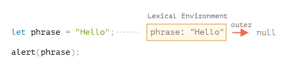
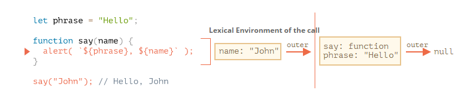

## 代码块

为了简单起见，我们不讨论使用`var`创建变量的情况，下面都是使用`let`声明变量

如果在代码块内部声明了一个变量，那么这个变量只在代码块内部可见
```
{
  let a = 'liu'

  console.log(a) // 'liu'
}

console.log(a) // error, a is not defined
```

如果不使用代码块包裹，声明同一个变量会报错
```
let a = 'liu'

let a = 'zhang' // error, Identifier 'a' has already been declared
```

所以我们经常使用的`if/else`、`while`、`for`包裹的代码变量都是局部可见的，有个不太明显的就是`for`，虽然看起来是在花括号外面定义的循环变量，但该变量被视为代码块的一部分
```
for (let i = 0; i < 10; i++) {
  // code
}

console.log(i) // error
```

在`for`循环中使用`let`声明循环变量，由于块级作用域的原因，每次循环时都是重新声明一个新的变量，JS引擎会记住上一次循环的值并在其基础上赋予新值，如果使用了这个临时变量，程序就会保存在内存中等待调用
```
for (let i = 0; i < 5; i++) {
  setTimeout(() => {
    console.log(i)
  })
}

// 输出: 0, 1, 2, 3, 4
```

`for`循环还有一个特殊之处，就是它设置循环变量的部分和循环体内部不是同一个作用域，循环体内部成一个独立的子作用域
```
for (let i = 0; i < 5; i++) {
  let i = 'haha'
  console.log(i)
}

// 输出：5次`haha`
```

## 嵌套函数

当一个函数在另一个函数内部被声明，我们称这个函数为嵌套函数，它只存在于这个函数内部，它可以调用外部函数的参数和变量，也可以使用全局变量和全局方法，如果我们返回这个嵌套函数，它仍然可以访问定义时外部函数的变量，这种行为被称为闭包
```
function createSumFn(a, b) {
  function getSum() {
    return a + b
  }

  return getSum
}

let sum = createSumFn(1, 2)

sum() // 3
```

要理解这种行为的原因，我们必须先了解词法环境

## 词法环境

### 变量

在JS中，执行的函数、代码块、全局脚本都有一个被称为`词法环境`的内部隐藏的关联对象，该对象有两个部分，一个是环境记录，另一个是对外部词法环境的引用



环境记录这个对象保存着所有局部变量和函数参数（如果有的话）作为其属性，此外还保存着`this`的值，所以变量只是环境记录这个特殊内部对象的一个属性，我们创建修改变量实际上是创建或修改词法环境的一个属性

图中的代码并没有被任何代码块包裹，所以运行在全局的词法环境中，其外部引用为`null`

**词法环境是假想的对象，存在于`编程语言规范`中，我们使用这个定义来描述JS引擎内部如何运作，所以实际上我们无法访问到这个对象**

### 函数声明

函数其实也是一个变量，一个值，不同之处在于函数声明的初始化会立即完成（函数表达式除外），当我们创建了一个词法环境时，函数声明会立即变为即用型函数，这就表明了为什么我们可以在声明前调用函数（具体的原理是创建词法环境后会检索该环境中的所有函数声明并提到首部进行初始化操作）

**使用`let`声明的变量在代码块中无法提前使用，被称为暂时性死区，这是因为变量的声明不同于函数声明，变量在词法环境创建时会被声明（表述不太准确，其实是占位）但不进行初始化，这是一种特殊的状态，这个状态下我们无法提前使用该变量，但它的确被程序所知，直到`let`后才被初始化，这时我们才真正的可以使用这个变量**

### 内部的词法环境和外部的词法环境

函数在执行时，在调用的开始阶段，会自动的创建一个新的词法环境以存储这个调用的局部变量和参数



这样在调用时，我们就拥有一个内部的词法环境和一个对外部词法环境的引用

**当执行的代码要访问一个变量时，首先搜索内部词法环境，然后搜索外部词法环境，接着搜索更外部的词法环境，直至全局词法环境**

如果在任何地方都找不到这个变量，在严格模式下会报错，而在非严格模式下会给未定义的变量创建一个全局变量

### 返回函数

前面我们了解到函数的执行会创建词法环境，但我们返回一个函数的话，词法环境又是怎么变化的呢

举个例子
```
function makeCounter() {
  let count = 0;

  return function() {
    return count++;
  };
}

let counter = makeCounter();
```

在`makeCounter`方法中我们创建了一个词法环境保存着局部变量`count`，然后我们返回了一个匿名函数，这个函数只有一行，并且未执行，但在该匿名函数声明时，其隐藏属性`[[Environment]]`保存着声明时的词法环境，虽然在这个例子中它的环境记录没有任何属性，但该词法环境记录着对外部词法环境的引用

所以我们执行`makeCounter`方法得到这个匿名函数后，我们就继续引用了这个函数，那么它的词法环境就不会被垃圾回收机制回收，所以它的外部词法环境就不会被回收，所以可以访问到`count`变量

## 垃圾回收

在JS中，如果一个函数调用完成，那么会将词法环境和其中所有的变量从内存中删除，因为这时已经不存在任何对它们的引用了，与其他对象一样，只有在被可达时才会继续保存在内存中

正如上面说到的，如果一个嵌套函数在外部函数调用完成后被返回，那么我们就可以继续引用这个函数，那么它的词法环境就是可达的

**每次调用函数都会生成新的词法环境，它们被存在内存的不同区域，这说明我们调用同一个方法多次，生成的词法环境是完全不同的，即使它们看起来一样**

上面的规则让我们可以实现多个闭包，各个闭包之间的使用互不影响