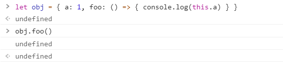

## 引子

虽然说在JS中，万物皆对象，但是平时编程时我们接触比较多的还是变量和函数，接下来我们要探究的是在变量声明和函数执行中的一些细节，变量的声明和使用是和上下文息息相关的

我们在使用变量时要确定两件事，一件事是在定义时将变量保存到哪里，一件事是使用变量时如何通过上下文环境找到这个变量

## 上下文

上下文的概念其实很简单，我们都清楚在老的`ECMAScript`规范中，只有函数会构成独立的作用域，也就是拥有独立的上下文，而像`for`循环语句中定义的变量是没有局部的上下文的，同理，在一个对象的声明时也无法创建一个独立的上下文

循环的情况：


创建对象的情况：



这里用来说明对象不构成独立作用域不是很清晰，我们首先需要了解箭头函数的原理，这里简单介绍一下，箭头函数中使用this不会像原先一样等到调用时才确定，而是在定义时就会去上下文中找一个包含当前执行环境中所有变量方法的对象，如果找不到就会去外层找，最后会找到全局对象

**在拥有箭头函数的前置知识后，我们可以分析出，由于对象不形成独立作用域，所以在调用foo方法时，this实际上是指向window对象的，而window对象不存在a属性，所以输出undefined**

## 变量对象

在了解上下文的概念后，我们自然要弄清楚上下文在变量的读取和存储中扮演的角色，简单来说，上下文类似于一个容器，代码在这个容器中运行，而容器中除了运行代码的块，也有存储数据的块，被称为变量对象，接下来我们分全局和函数内部两个环境来解释一下

### 全局环境

我们需要给全局对象一个定义
```
全局对象是一个在执行任何代码之前就被创建的一个对象，它只有一个实例并且在代码的任何地方都能访问，直到程序终结退出的那一刻被销毁
```

在全局对象的创建阶段，会将一些内置对象`Math`、`Date`，一些方法`String`、`isNaN`，一些属性`global`、`self`作为自身属性初始化，全局对象本身是不能被直接引用的，但其定义了多个属性引用自身，所以我们可以使用类似`window`属性来实现间接引用

我们注意到一个细节，就是使用这些定义在全局对象上的方法时，我们通过`window.isNaN`的方式引用，这意味着全局对象的变量对象就是全局对象本身

所以在全局上下文中，比如浏览器控制台，我们执行代码得到的变量对象`AO`可以被访问，比如：
```
var a = 1

b = 2

console.log(window.a) // 1
console.log(window.b) // 2
```

更进一步，JS提供了一种简写方式，就是省略全局对象的引用前缀，比如
```
String(0) 等价于 window.String(0)
```

### 函数内部

函数中我们会涉及到函数内部的变量、形参、函数内部的方法、`arguments`对象，这些变量会存在函数变量对象中，不同于全局变量对象的是，这个变量对象`VO`无法被直接访问，取而代之我们使用活动对象`AO`，这个活动对象通过函数的`arguments`属性对象初始化

对于`arguments`对象，它是活动对象的一个属性，所以可以在函数内部使用，通常包含如下属性

- length，真正传递的参数个数
- callee，指向当前函数的引用
- 通过数字下标来顺序引用的传入参数，下标从0开始

## 执行代码的流程

执行一段代码，比如说我们调用一个函数时，内部实际上发生了两件事

- 进入执行上下文
- 执行代码

### 进入执行上下文

这个的意思实际上就是初始化变量，对于不同的变量有不同的处理

1.对于函数的形参，往变量对象中加入一个属性，key为形参名，value为传入的参数的值，没有传递的话则值为undefined

2.对于函数声明，加入一个以函数名为key，具体实现为值的属性，如果这个属性已经存在，则完全替换这个属性

3.对于函数内部的变量，创建一个key为变量名，值为undefined的属性，如果该属性已经是形参或者函数声明，则这个创建会失效从而不对上面两者造成干扰

举个例子
```
function test (a, b) {
  var c = 10

  function d() {}

  var e = function _e() {}

  (function x() {})
}

test(10)
```

在我们调用`test`时，我们得到这样一个AO对象
```
AO(tets) = {
  a: 10,
  b: undefined,
  c: undefined,
  d: 函数的内存地址,
  e: undefined
}
```

主要要看得就是函数`_e`和`x`，虽然这两个函数都是函数表达式，但函数表达式并不会影响`VO`，即使函数`_e`在后面作为一个值赋给变量`e`，但这只是代码执行阶段的一个修改行为

### 执行代码

通过进入执行上下文这一步骤，我们得到了一个不可被直接访问的变量对象，其内部的属性大部分的值为系统的默认值（undefined），接下来在代码执行阶段，我们可以对变量对象进行修改

这就是为什么我们在函数内部可以提前打印出变量，但值为undefined的原因，根据这个规则，我们还可以知道，我们如果定义一个和函数声明同名的变量，在执行上下文这一阶段，是无法再次对同名key的值进行修改的，就是下面的情况
```
function test (a, b) {
  console.log(d) // 打印出该函数的声明代码，而不是undefined

  function d() {}

  var d = 10
}
```

## 关于变量对象的几种特殊情况

1.我们直接在全局中不用`var`声明一个变量时，实际上不是声明变量，而是给全局对象绑定一个属性，变量一个显而易见的特征就是无法通过`delete`操作符删除，我们可以通过下面的实验进行验证
```
var a = 10

b = 20

delete window.a // false

delete window.b // true
```
所以如果我们的目的不是给全局对象绑定属性的话，最好使用`var`定义全局变量

2.对于`eval`方法而言，它的行为不符合上面的规则，一个例子
```
eval('var a = 10')

delete window.a // true

```