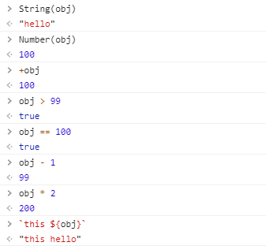

## 前言

JS的数据类型可分为原始类型和对象类型，原始类型有`string`、`number`、`boolean`，其中又有两个特殊的原始值代表各自特殊数据类型的唯一成员`null`和`undefined`，对象类型有`object`，此外，近几年定义了两种新的原始数据类型`symbol`、`bigint`

我们可以通过`typeof`运算符来大致判断其是哪种数据：


图中的结果有两个表现不一致的地方，对null的判断是`object`（这时typeof实现的一个BUG），对函数的判断是`function`（我们知道JS中函数也是对象，所以这不合理）

我们可以使用更加严谨的`Object.prototype.toString.call`来获取精确的判断


所以我们可以封装一个更精确判断数据类型的方法
```
function isType (val, expected) {
  return /\[object (\w+)\]/.exec(Object.prototype.toString.call(val))[1].toLowerCase() === expected
}
```

然后像这样使用`isType(1, 'number')`

## 原始值之间的转换

### 转字符串

当我们需要一个字符串形式的值时，就会进行字符串转换，此外，我们可以显式调用`String`来将值转换成字符串


**注意`bigint`类型和`symbol`类型的特殊情况，我们后面讲**

### 转数字

在算数函数和表达式中，会自动进行number类型转换，此外，我们可以显式调用`Number`来将值转换成数字


如果一个值转换后不是有效数字，结果将会是`NaN`，对于`null`值在转换时变成`0`，而`undefined`变成`NaN`

### 转布尔值

我们使用`!!`运算符的规则测试，除了下面几种情况，其他都为`true`


## 对象转原始值

由于对象在布尔上下文中表现均为`true`，所以我们不需要考虑`to-boolean`的转换

对于字符串和数值的转换，对象内部有特殊的方法对对象进行微调，我们把转换的情况分为三类，称为`hint`，它在规范中有详细介绍

### string

当我们的运算符希望将一个对象作为字符串处理时，比如`alert`方法，我们会在运算符或方法中指定`hint`为`string`

```
let obj = {}

alert(obj) // 输出[object Object]
anotherObj[obj] = 123 // key值为[object Object]
```

### number

同样的，当我们的运算符希望将一个对象作为数字处理时，比如`*`运算符和`<>`比较运算符，我们会在运算符或方法中指定`hint`为`number`

```
let obj = {}

2 * obj // NaN
+obj // NaN
Number(obj) // NaN
```

### default

对于某些运算符我们不清楚到底要把对象转换成字符串还是数字的时候，比如`==`运算符和`+`运算符执行二元加法时，使用`default`的`hint`

```
let obj = {}

obj + obj // [object Object][object Object]
obj == 1 // false
```

大部分内建对象（除了`Date`对象）`default`的转换实现和`number`相同，我们不必刻意记住这些细节

### 转换流程

为了实现转换，JS会尝试以下三种途径

1. 调用`obj[Symbol.toPrimitive](hint)`如果这个方法存在的话，`hint`不需要我们传入，在计算时由内部的操作函数传入

2. 如果上面的方法不存在，判断`hint`是否是`string`，如果是尝试调用`obj.toString()`和`obj.valueOf()`，注意顺序

3. 否则如果`hint`是`number`，则尝试调用`obj.valueOf()`和`obj.toString()`，注意顺序

#### Symbol.toPrimitive

该方法以一个名为`Symbol.toPrimitive`的内建`symbol`作为方法名，标识这是一个转换方法，我们可以手动实现它

```
let obj = {
  name: 'hello',
  value: 100,

  [Symbol.toPrimitive](hint) {
    return hint === 'string' ? this.name : this.value
  }
}
```

接着我们在浏览器中验证一下



#### toString和valueOf

这两个方法比较古老，他们提供了一种可选的老的实现转换的方式，如果没有`Symbol.toPrimitive`方法将尝试找到它们，并按下面的顺序执行

- 如果`hint`是`string`，`toString -> valueOf`
- 其他情况，`valueOf -> toString`

这两个方法都必须返回原始值才会被采用，如果得到的是复合类型则会被忽略，默认情况下，普通对象不具有`Symbol.toPrimitive`方法，但会从原型链中继承`toString`和`valueOf`方法

- 默认的`toString`方法返回一个字符串`[object Object]`
- 默认的`valueOf`方法返回对象自身

所以我们也可以手动实现这两个方法
```
let obj = {
  name: 'hello',
  value: 100,

  toString() {
    return this.name
  },

  valueOf () {
    return this.value
  }
}
```

下面验证一下


我们发现和上面的结果是一样的，符合预期

## 特殊的Date对象

`Date`对象转字符串，其内部重载了`toString`方法，返回一个本地时间信息的字符串

```
String(new Date())

// 结果
"Thu Oct 15 2020 15:05:38 GMT+0800 (中国标准时间)"
```

`Date`对象转数字，内部同样重载了`valueOf`方法，返回从`1970年1月1日`到目前的毫秒数
```
+new Date('1970-01-01') // 0
```

## 一些奇葩的特殊情况

1.位于句首的`{}`会被当成代码块并被忽略

