JS的数据类型可分为原始类型和对象类型，原始类型有`string`、`number`、`boolean`，其中又有两个特殊的原始值代表各自特殊数据类型的唯一成员`null`和`undefined`，对象类型有`object`，此外，近几年定义了两种新的数据类型`symbol`、`bigint`

我们可以通过`typeof`运算符来大致判断其是哪种数据：

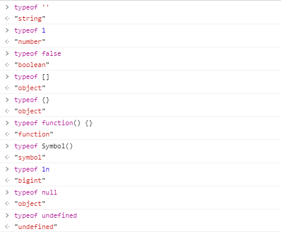

图中的结果有几个表现不一致的地方，对数组的判断是`object`，对null的判断是`object`，对函数的判断是`function`（我们知道JS中函数也是对象）

我们可以使用更加严谨的`Object.prototype.toString.call`来获取精确的判断

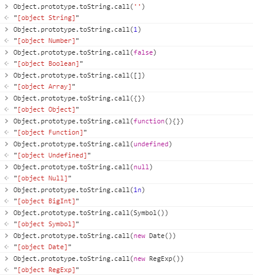

所以我们可以封装一个更精确判断数据类型的方法
```
function isType (val, expected) {
  return /\[object (\w+)\]/.exec(Object.prototype.toString.call(val))[1].toLowerCase() === expected
}
```

然后像这样使用`isType(1, 'number')`

## 各种数据类型之间的转换规则

### 转字符串

1.其他数据类型转字符串分为原始类型转字符串和对象类型转字符串，原始类型转字符串就是直接转化

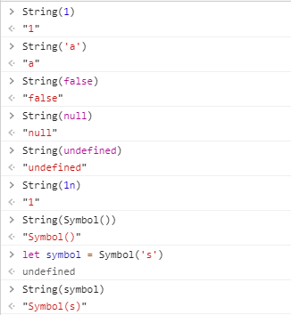

**注意`bigint`类型的数据在转为字符串时会舍去末尾n**

2.对象类型转字符串有一个特殊情况`Date`，先不提，其他对象转化的规则是先调用`toString`方法，如果值是原始值但不是字符串就把结果转为字符串，如果不是原始值再调用`valueOf`方法，跟前面一样尽可能得出一个字符串，均无法获得字符串则报错

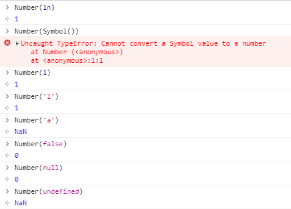

至于`Date`对象转字符串，其内部重载了`toString`方法，返回一个本地时间信息的字符串

```
String(new Date())

// 结果
"Thu Oct 15 2020 15:05:38 GMT+0800 (中国标准时间)"
```

### 转数字

同样的，原始值转数字一般能转的转成数字值，否则是`NaN`，注意null转为0而undefined转为NaN

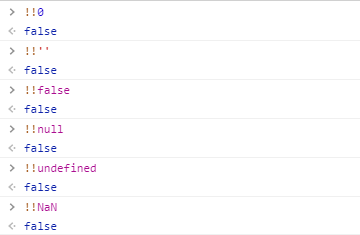

对于对象，和前面对象转字符串有些不同，顺序是先调用`valueOf`方法，然后调用`toString`方法

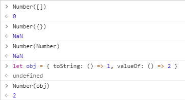


对于`Date`对象，内部同样重载了`valueOf`方法，返回从`1970年1月1日`到目前的毫秒数
```
+new Date('1970-01-01') // 0
```

### 转布尔值

我们使用`!!`运算符的规则测试，除了下面几种情况，其他都为`true`


## ==比较中的隐式转换

`==`运算符的规则总结起来很简单，任意两种类型比较，先看是否是相同类型，相同类型直接比较，否则依据下面的图进行转化，变成同一类型后再比较

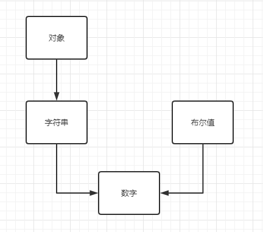

对于`null`和`undefiend`，在比较时不会将这两个进行转化

下面我们测试一下正确性

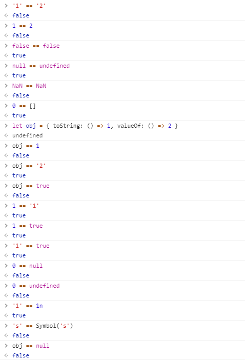

可以看出，上面的对象在比较时仍然是先调用`valueOf`方法拿到原始值，然后将原始值依据流程图中的规则转化成其他数据类型再比较

## +运算符中的隐式转换

### 原始值类型之间

1.`+`运算符的一方是字符串类型时，会把双方转成字符串再进行字符串拼接

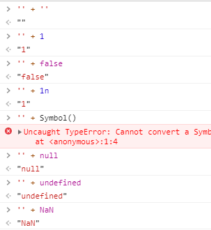

2.没有一方是字符串时，双方转成数字进行运算


### 对象和基本类型之间

首先调用`valueOf`方法转化为原始值，如果不成功再调用`toString`方法

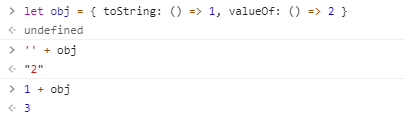

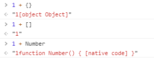

这里的结果是因为对象继承的`valueOf`方法在无法转为原始值时会简单的返回本身，所以会接着调用`toString`方法

## 其他运算符的隐式转换

原始值都先转化数字类型再进行运算，对象类型和`+`运算符一致，都是先`valueOf`后`toString`

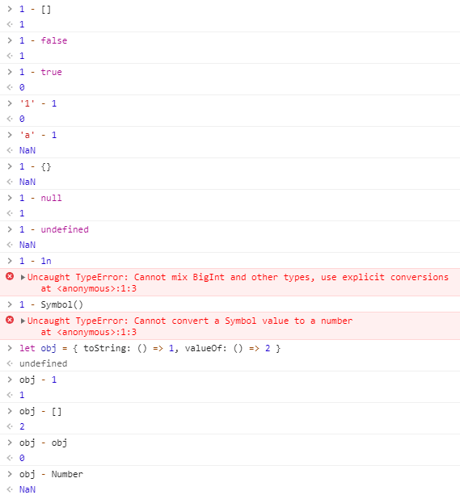

## 一些奇葩的特殊情况

1.位于句首的`{}`会被当成代码块并被忽略

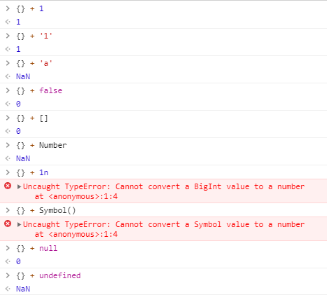

2.如果运算的双方都是对象类型

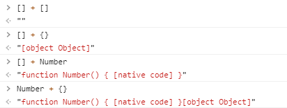

这种情况推测是先判断左运算数，对其求原始值（默认先调valueOf方法），然后根据原始值的类型依照上面的规则进行计算

下面是验证

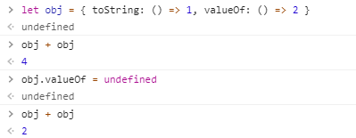