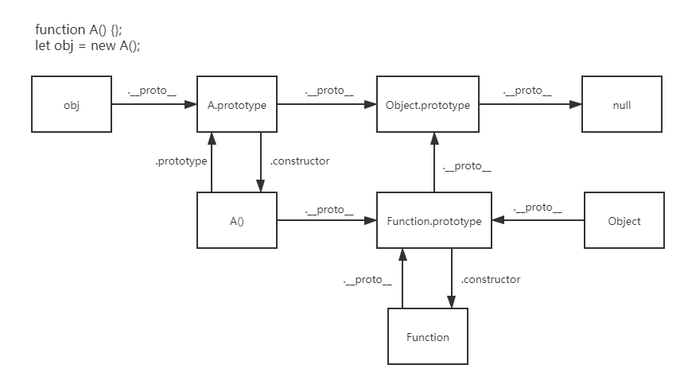
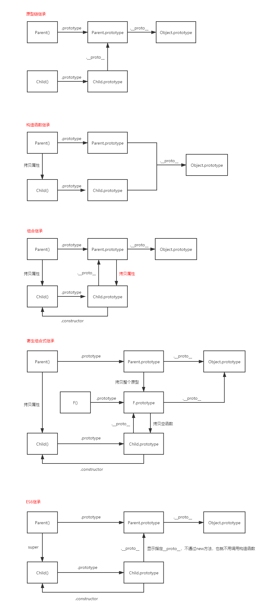

## 原型和原型链

1.构造函数和普通函数的区别主要在于其功能性，普通函数被用来封装可被复用的代码块，而构造函数则是通常与`new`搭配，生成实例化的对象，一般约定对构造函数的首字母大写；`new`操作符内部主要干了两件事，一件是申请内存（创建新对象），同时在内部生成一个`this`指针指向该片内存，另一件是执行构造函数中的代码，为这个新建对象添加属性和方法，最后返回这个创建的对象

2.上面说明任何一个函数都能作为构造函数存在，只要使用`new`操作符生成的实例化对象，其原型`__proto__`都等于构造函数的原型对象`prototype`，在构造函数原型对象原型上存在一个`constructor`属性，就是构造函数本身
```
function A() {};
let obj = new A();

obj.__proto__ === A.prototype // true
A.prototype.constructor === A // true
```

3.`JS`中对于属性方法的引用有这么一条规则，首先在该对象内部寻找，找不到后会去其原型上继续寻找，直至`Object.prototype`对象，这个过程中`prototype`属性充当链接的作用，将各个对象串联起来，形成了所谓的原型链
    
4.试着从历史角度分析一下原型链的产生原因，当初在设计`JS`时，作者定义了一个原型对象，我们称为`Object.prototype`，其`__proto__`指向`null`，紧接着定义了`Function.prototype`这个对象，并把其`__proto__`指向`Object.prototype`，这个对象的`constructor`属性是`Function`构造函数，所有函数都可以看成是由`new Function`得到，这时，我们就已经拥有了对象和函数两个基础，这时我们再规定构造函数实例化对象的原型指向其`prototype`属性，就实现了对象和函数的闭环


**只有函数才具有`prototype`属性**

**`Function`构造函数的`__proto__`规定指向`Function.prototype`**

**`Object.prototype`被特异化为原型链的终点**


下面的图例便于理解：



理解了上面的图后下面的几个问题就很清楚了：
```
Object.getPrototypeOf(Object) === Function.prototype // true

Object instanceof Function // true
// 检测Function的原型链（__proto__）上是否有Object.prototype，若有返回true，否则false
Function instanceof Object // true

Object.__proto__ === Function.prototype // true
```

## 继承

1.`hasOwnProperty`被用于检索对象中是否存在该属性并且不会在原型链上查找
```
let obj = {};
obj.hasOwnProperty('toString') // false
```

2.`isPrototypeOf`用来判断该方法所属的对象是不是参数的原型对象
```
Object.prototype.isPrototypeOf(obj) // true
```

3.`instanceof`用来在运行时指出对象是否是构造器的一个实例，实质是内部判断前者的原型链上是否存在后者的`prototype`
```
obj instanceof Object // true
```

4.继承就是子类继承父类的属性和行为，类似于子承父业，`JS`要实现完美的继承要注意：继承子类的每个实例化对象对于父类属性的改写是独立的，不会向父类添加额外的属性和方法，继承后原型链指向正确

5.原型链继承，所谓的原型链继承，就是将子类的原型对象指向父类的实例化对象
```
function Parent(name) {
    this.name = name;
}

function Child() {}
Child.prototype = new Parent();
Child.prototype.constructor = Child;
```

优点：可以调用父类原型上定义的方法
缺点：父类原型上的属性被子类实例共享，子类构建实例时无法向父类构造函数传递参数

6.构造函数继承，将父类构造函数的内容拷贝一份给子类构造函数，不涉及到原型链，其优缺点正好和原型链继承相反
```
function Parent(name) {
    this.name = name;
}

function Child(name) {
    Parent.call(this, name);
}
```

优点：父类原型上的属性不会被子类实例共享，子类构建实例时可以向父类构造函数传递参数
缺点：无法复用父类原型上定义的方法

7.组合继承，原型链继承和构造函数继承的组合，兼顾了上面二者的优点，缺点是调用了两次父类构造函数，第一次复制父类构造函数中的属性，第二次调用父类构造函数生成了一个空值属性，造成了性能的浪费
```
function Parent(name) {
    this.name = name;
}

function Child(name) {
    Parent.call(this, name);
}

Child.prototype = new Parent();
Child.prototype.constructor = Child;
```

8.寄生组合式继承，为解决上面组合继承两次调用父类构造函数的问题而提出，是一种完美的继承方案
```
function Parent(name) {
    this.name = name;
}

function Child(name) {
    Parent.call(this, name);
}

var F = function() {};
F.prototype = Parent.prototype;
Child.prototype = new F();
Child.prototype.constructor = Child;
```

该方法的巧妙之处在于创建一个空的构造函数`F`，这样调用`F`生成实例时不会再次复制父类的属性，同时又修改了原型链

使用`Object.create`实现
```
function Parent (name) {
  this.name = name
}

function Child (name) {
  Parent.call(this, name)
}

Child.prototype = Object.create(Parent.prototype)
Child.prototype.constructor = Child;
```

直接使用`__proto__`
```
function Parent (name) {
  this.name = name
}

function Child (name) {
  Parent.call(this, name)
}

Child.prototype.__proto__ = Parent.prototype
```


8.`ES6`的`Class extends`继承，实际效果和寄生组合式继承相似，前者是先将父类的属性和方法拷贝一份，然后将`this`指针指到这个拷贝对象上，最后调用子类的构造函数修改`this`；后者是先创建子类的`this`指针对象，然后先对其添加父类属性，接着添加子类自身属性，最后通过`new`添加父类方法
```
class A {}
class B extends A {
    constructor() {
        super() // 先调用父类构造函数
    }
}

// 具体原理

class A {}
class B {}

Object.setPrototypeOf = function (obj, proto) {
    obj.__proto__ = proto;
    return obj;
}

Object.setPrototypeOf(B.prototype, A.prototype);
Object.setPrototypeOf(B, A) // 修改了B的构造函数原型链指向
```

各种继承方式的原型链示意图：
