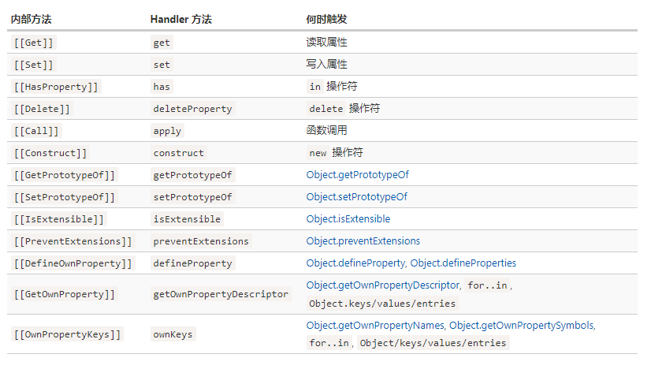

## Proxy

1.`Proxy`是ES6推出的新语法，用于在目标对象前设置一层拦截，当我们试图操作目标对象时，都会被这个拦截器拦截下来，这样我们就可以修改这些操作以改变其默认行为

2.`Proxy`和`Object.defineProperty`的区别

- `Proxy`更加强大，拥有13种修改对象的方法，而`Object.defineProperty`只能挟持属性的`getter`和`setter`
- `Proxy`作用于整个对象，而`Object.defineProperty`只能操作属性
- `Proxy`能够作用于嵌套对象，而`Object.defineProperty`需要深度遍历

3.`Vue3`使用`Proxy`后和原先的区别

- 可以挟持新增属性或者删除属性的操作了，因为`Proxy`代理是对象级别的
- 使用`Proxy`的消耗比`Object.defineProperty`更少，原来考虑性能移除的数组监听现在可以实现了
- `Proxy`只拦截使用的（或者指定的）对象，对于对象中没有使用的嵌套对象会在调用时才进行拦截，而`Object.defineProperty`则是递归监听所有属性，增加了开销
- `Proxy`不兼容IE，而`Object.defineProperty`可以兼容到IE9
- `Proxy`可以操作更多的对象默认行为，比`Object.defineProperty`更强大
- `Proxy`作为新标准、未来的主流，会被浏览器厂商重点关注，持续优化

### Proxy基础

1.使用`Proxy`很简单，我们只需要拿到目标对象`target`和代理配置`handler`，就可以调用`new Proxy`生成一个代理对象，我们后面就只需要使用这个代理对象就行
```
let obj = {
  name: 'liuxiang'
}

let handler = {
  get (target, prop) {
    return target[prop]
  }
}

let p = new Proxy(obj, handler)

p.name // 'liuxiang'
```

2.可以把代理配置设置为一个空对象，这样所有对代理对象的操作会被直接转发到目标对象，注意这时代理对象不是目标对象的副本，它只是目标对象的一个透明包装器
```
let obj = {
  name: 'liuxiang'
}

let p = new Proxy(obj, {})

p.name // 'liuxiang'

p === obj // false
```

3.在JS规范中，这些操作实际上调用的是所谓的内部方法，比如`[[Get]]`就是读取属性的内部方法，`[[Set]]`是写入属性的内部方法，这些内部方法仅在规范中用于描述如何操作对象，在引擎内部使用，我们无法直接访问到这些方法，只能访问到使用这些内部方法实现的`API`比如对象的点操作符和`[]`，`Proxy`拦截的就是这些内部方法的调用，`Proxy`的捕捉器和这些内部方法一一对应



4.可取消的`Proxy`，我们调用`Proxy.revocable`方法得到一个对象，该对象包含两个属性`proxy`和`revoke`，前者就是代理对象，后者调用后取消这个代理对象,不允许其再次访问
```
let obj = {
  name: 'liuxiang'
}

let { proxy, revoke } = Proxy.revocable(obj, {})

proxy.name // 'liuxiang'

revoke()
proxy.name // error
```

### receiver参数的作用

1.针对`get`和`set`捕捉器，它们的第三或者第四个参数名为`receiver`，它作用于当目标属性是`getter`访问器时，指定本次读取属性的`this`对象，通常是`proxy`对象本身，如果某个对象继承了这个代理对象，那么`receiver`则是这个继承的对象

下面这个例子我们人为修改了`receiver`，验证我们的设想
```
let obj = {
  name: 'liu',

  get fullName () {
    return this.name + 'xiang'
  }
}

let handler = {
  get (target, prop, receiver) {
    return Reflect.get(target, prop, { name: 'wang' })
  }
}

let p = new Proxy(obj, handler)

console.log(p.fullName) // wangxiang
```

继承的情况下，`receiver`会自动更新为继承后的对象
```
let obj = {
  name: 'liu',

  get fullName () {
    return this.name + 'xiang'
  }
}

let handler = {
  get (target, prop, receiver) {
    return Reflect.get(...arguments)
  }
}

let p = new Proxy(obj, handler)

let p2 = {
  __proto__: p,
  name: 'zhang'
}

console.log(p2.fullName) // zhangxiang
```

### Proxy不变量

1.在使用`Proxy`的捕捉器时，大部分情况下我们不需要考虑一些限制条件只要我们不做一些导致语言功能不一致的事情，这些不变量会被强制执行用来判断设置的捕捉器是否满足条件

举个例子，严格模式下使用`set`捕捉器时，如果值成功写入，必须返回`true`，否则返回`false`
```
'use strict';
let obj = {
  name: 'liu'
}

let handler = {
  set (target, prop, value, receiver) {
    Reflect.set(...arguments)
  }
}

let p = new Proxy(obj, handler)

p.name = 'zhang' // TypeError: 'set' on proxy: trap returned falsish for property 'foo'
```

2.像上面这样的不变量还有很多，我们一一列举（部分在严格模式下有限制）

- `set`必须有返回值，设置成功返回`true`，否则返回`false`
- `deleteProperty`必须有返回值，删除成功返回`true`，否则返回`false`
- `getPrototypeOf`在目标对象不可拓展时，只能返回其原型对象
- `setPrototypeOf`在目标对象不可拓展时，不得改变其原型对象
- `has`在目标对象不可拓展时，不得隐藏对象的属性，只针对`in`操作符，不针对`for...in`
- `defineProperty`在目标对象不可拓展时，不得增加对象上不存在的属性，如果属性设置为不可配置和不可写，该方法也不能更改这两个配置
- `isExtensible`有强限制，它的返回值必须与目标对象的`isExtensible`属性保持一致
- `ownKeys`如果目标对象不可拓展，它的返回值必须包含原对象的所有属性，且不能包含多余属性
- `preventExtensions`如果目标对象不可拓展时才能返回`true`

### Proxy局限

1.前面我们提到，`Proxy`其实是拦截内部方法的调用，但有些情况并没有调用这些内部方法

许多内建对象都使用内部插槽，比如`Map`、`Set`、`Date`、`Promise`等，我们以`Map`举例，它内部使用了`[[MapData]]`存储数据，`Map`的其他内建方法可以直接访问它们不需要通过`[[Get]]`和`[[Set]]`，所以`Proxy`无法拦截
```
let map = new Map()

let p = new Proxy(map, {})

p.set('test', 1) // error
```

原因是`set`方法继承于`Map.prototype`，内部使用`this.[[MapData]]`来访问，但这时`this`指向代理对象，所以无法访问到

我们可以通过重写`get`捕捉器来解决这个问题
```
let map = new Map()

let p = new Proxy(map, {
  get (target, prop, receiver) {
    let val = Reflect.get(...arguments)

    return typeof val === 'function' ? val.bind(target) : val
  }
})

p.set('test', 1)
p.get('test') // 1
```

**同样的问题也发生在类的私有字段中，我们使用相同的方式解决它**

2.`Proxy`还有一个问题就是无法拦截严格相等性检查`===`，所以比较对象是否相等的所有操作和内部类都会区分对象和其代理对象

3.`Proxy`的性能取决于引擎，但是通常情况使用代理访问属性所需的时间会比直接访问要长几倍，在部分高性能场景要斟酌考虑

### Proxy应用

1.可以设置对象或数组的默认值，这样就不会发生访问不存在属性时报错的情况
```
let arr = []

let handler = {
  get (target, prop) {
    if (prop in target) {
      return target[prop]
    } else {
      return 0
    }
  }
}

let p = new Proxy(arr, handler)

p[10000] // 0
```

2.响应式对象
```
function observe (obj) {
  let getFn = []
  let setFn = []

  return new Proxy(obj, {
    get (target, prop) {
      if (prop === 'setGetFn') {
        return function (fn) {
          getFn.push(fn)
        }
      } else if (prop === 'setSetFn') {
        return function (fn) {
          setFn.push(fn)
        }
      } else {
        getFn.forEach(fn => fn(prop))
        return Reflect.get(...arguments)
      }
    },

    set (target, prop, value) {
      let res = Reflect.set(...arguments)

      res && setFn.forEach(fn => fn(prop, value))

      return res
    }
  })
}

let obj = {}

let p = observe(obj)

p.setGetFn(key => console.log(`get ${key}`))
p.setSetFn(key => console.log(`set ${key}`))

p.name = 'liuxiang' // set name

console.log(p.name) // 'liuxiang', get name
```

## Reflect

`Reflect`是一个内建对象，可配合`Proxy`使用简化创建过程，也可以独立使用操作对象，前面我们提到引擎内部使用内部方法如`[[Get]]`等操作对象，而`Reflect`这个对象包含的13个静态方法正是对应这些内部方法的最小包装

### 为什么需要Reflect

1.现阶段我们通过`Object.`来获取操作对象的方法，未来会慢慢移动到`Reflect`对象上，所以以后`Reflect`对象将能使用语言内部的方法

2.现阶段通过`Object.`来获取操作对象的方法，它们的返回值以及针对错误的处理完全不一致，容易造成歧义和心智负担，在`Reflect`对象已经统一了返回值和错误处理，更加符合规范

3.现在操作对象的方式部分调用方法部分是命令式如`in`、`delete`等，在`Reflect`对象中全部统一成函数行为

### Reflect的静态方法

`Reflect`对象被设计成和`Proxy`对象捕捉器相同的传参，这样我们就可以在捕捉器内部方便的使用
```
Reflect.get(...arguments)
```

下面列一下所有方法仅供参考
```
Reflect.apply(target, thisArg, args)
Reflect.construct(target, args)
Reflect.get(target, name, receiver)
Reflect.set(target, name, value, receiver)
Reflect.defineProperty(target, name, desc)
Reflect.deleteProperty(target, name)
Reflect.has(target, name)
Reflect.ownKeys(target)
Reflect.isExtensible(target)
Reflect.preventExtensions(target)
Reflect.getOwnPropertyDescriptor(target, name)
Reflect.getPrototypeOf(target)
Reflect.setPrototypeOf(target, prototype)
```