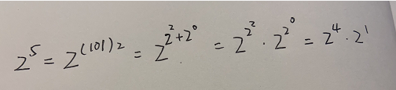

## 题目

[原题链接](https://leetcode-cn.com/problems/shu-zhi-de-zheng-shu-ci-fang-lcof)

具体问题：

```
实现函数double Power(double base, int exponent)，求base的exponent次方。不得使用库函数，同时不需要考虑大数问题。
```

## 思路

1.这题要求整数的次方，注意到幂可以是正数也可以是负数，是负数时则对当前数开方

2.考虑使用库函数的话，JS中可以使用`Math.pow`和`**`
```
Math.pow(2, 10) // 1024
Math.pow(2, -2) // 0.25

2 ** 10 // 1024
2 ** -2 // 0.25
```

3.考虑使用循环，注意负数情况
```
function myPow (base, exp) {
  let isNegative = exp < 0
  let res = 1
  exp = Math.abs(exp)

  for (let i = 0; i < exp; i++) {
    res *= base
  }

  return isNegative ? 1 / res : res
}
```

4.循环的话由于是重复的问题，我们可以使用二分法加快累积，我们首先推导出
```
奇数时： res = pow(base, exp >> 1) * pow(base, exp >> 1) * base
偶数时： res = pow(base, exp >> 1) * pow(base, exp >> 1)
```

按照这个思路实现一下
```
function myPow (base, exp) {
  let isNegative = exp < 0
  let res = 1
  exp = Math.abs(exp)

  function _pow (base, exp) {
    if (exp === 0) return 1
    if (exp === 1) return base

    let tmp = _pow(base, exp >> 1)

    return tmp % 2 ? tmp * tmp * base : tmp * tmp
  }

  res = _pow(base, exp)

  return isNegative ? 1 / res : res
}
```

5.这题还可以利用位运算，我们首先拿例子推导一下
```
2 ** 5 === 2 ** (4 + 1) === 2 ** (2 ** 2 + 2 ** 0)

可以看出如果对base进行自乘，会导致指数翻倍，对应二进制转十进制的算法
```

如图所示：



可以看到在步骤3时，我们发现我们累积二进制中为1的结果，而在二进制为0的时候对指数的幂进行翻倍

根据这个推论我们实现一下
```
function myPow(base, exp) {
  let isNegative = exp < 0
  let res = 1

  exp = isNegative ? -exp : exp
  
  while(exp) {
    if (exp & 1) {
      res *= base
    }

    base = base * base
    exp = exp >> 1
  }

  return isNegative ? 1 / res : res
}
```