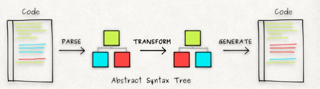

## 什么是Babel

Babel是一个JavaScript编译器，它将用户编写的ES678910语法编译成当下环境（浏览器或其他平台）可执行的版本，在babel的支持下，我们可以使用最新的js语法，甚至是提案

## babel的基本知识

babel转化js代码的过程可以简述为 解析 -> 转换 -> 生成

babel本身只干解析和生成两件事，转换功能被拆解到插件里，所以如果不安装任何插件，babel的输入输出是相同的

### 插件

插件分为语法插件和转译插件：

  - 语法插件使得babel能够解析更多的语法（babel内部使用的解析类库为babylon，非自己开发）
  - 转译插件，将源码转化成老版本（ES5）的写法，是babel的本质需求
  
  语法插件的例子：以前我们是不允许在函数参数的末尾添加逗号的，如果源代码这样写，会得到babel的报错提示，如今js提案已经允许这种写法，这样我们就需要安装babel-plugin-syntax-trailing-function-commas语法插件

  转译插件的例子：将箭头函数转化成老的函数写法安装babel-plugin-transform-es2015-arrow-functions转译插件

所以我们在babel配置文件中，主要配置的就是插件

    // .babelrc
    module.exports = {
      presets: [
        // 插件集合
      ],
      plugins: [
        // 插件
      ]
    }

### preset

上面的配置文件中提到了presets选项，该选项存在的意义主要是节省开发者安装插件的时间，比如ES6的新特性包含了几十个插件，大部分情况我们不需要定制某些特性，而是希望使用所有的新特性，因此，我们需要所有的这些插件，因此根据需求和实际情况，提供了多种多样的插件集合，我们称为preset

preset分为官方的和stage-X两类

- 官方的preset有env、react、flow等
- stage-X里面包含的都是最新草案的插件列表，每年更新，一共有0~3，低级的版本会包含高级的版本，第四版会在下一年加入官方的env中，所以没有单独的版本

### 执行顺序

默认plugins选项的执行是最早的，它会依照着在plugins选项中的顺序依次执行

presets的执行顺序位于plugins之后，且它是倒序执行的，这是为了保证向后兼容，意思是如果你在最开始就把代码转译成ES5的代码，那么后面转译更新的语法时就会出现找不着该语法的情况从而报错

其实我们只要遵守在编排preset时**按照规范制定的时间列出即可**

### 配置项

简略情况，presets和plugins都只需要列出字符串名称即可，但是如果某个preset或者插件需要进行配置的话，则需要使其变成数组格式

    [
      'env',
      {
        module: false
      }
    ]

### env

env出现的目的就是减少用户判断使用环境选择preset的成本，它能够根据项目的配置得知运行环境的特点，只做必要的转换，比如如果浏览器支持ES6，那么就不需要es2015这个preset，减少构建时间

如果不加配置项，env等价于lastest，也就是 es2015 + es2016 + es2017三者相加

    presets: [
      [
        'env',
        {
          targets: {
            browsers: ['last 2 versions', 'safari >= 7']
          }
        }
      ]
    ]

这个配置的意思是只考虑所有浏览器的最新的两个版本以及Safari大于7.0的版本的特性，这些浏览器已经支持的特性就不再转译了

对于node环境可以这样配置，表示支持最新的稳定版本

    presets: [
      [
        'env',
        {
          targets: {
            node: 'current'
          }
        }
      ]
    ]

### 配套工具

所有babel的工具对于babel的核心处理和配置都是没有改变的，只是调用方式（入口）的不同

#### babel-cli

cli就是命令行工具的意思，安装了该工具后，我们可以在命令行使用babel命令来转译代码

在npm下，我们开发时会将其安装到devDependencies中，然后在package.json文件中添加scripts命令

    "scripts" : {
      "publish": "babel src -d dist"
    }

这种方式的好处是不需要像其他工具一样要安装一堆包也能够使用babel

#### babel-node

babel-node属于babel-cli的一部分，它允许我们直接在node环境运行ES6代码，即使node环境本身不支持

    babel-node demo.js

babel-node可以说是babel-register和babel-polyfill的集合，这两者我们下面说明

#### babel-register

babel-register能够改写require命令，我们在引入其他包时，调用的require命令被增加了一个钩子，用于转译要引入的包，适用于以`.js`、`.jsx`、`.es`、`.es6`为后缀的文件

单独使用时，我们手写要加载该包

    require('babel-register')

由于babel-register只是改写require，如果没有使用require，是不会对文件进行编译的，比如当前文件，而且因为他是引入时转译，是实时的，所以适合开发环境使用

#### babel-polyfill

babel本身是只转译语法的，一些新的API，如Iterator、Generator、Set、Map、Proxy、Reflect、Symbol、Promise等全局对象，以及一些挂载在全局对象上的方法都不会转码

举个例子，Array新增的from方法，就无法被babel转译，我们只能在使用该方法的首部加上

    require('babel-polyfill')

如果使用了webpack作为构建工具，则是在webpack.config.js将babel-polyfill作为第一个entry，此外我们需要在dependencies安装，否则打包后会无法使用

使用babel-polyfill的缺点是：

- 打包出来的代码体积十分大，这是因为直接加载babel-polyfill会将所有实现都挂载到原型链上，如果我们只使用了部分特性，就是一种浪费
- 使用babel-polyfill意味着污染了全局变量，修改了原型链，如果我们开发的项目也作为类库供其他开发者使用的话，就会出问题

所以实际使用过程中，我们会倾向于使用babel-plugin-transform-runtime

#### babel-plugin-transform-runtime 和 babel-runtime

不同于babel-polyfill直接修改原型链，babel-plugin-transform-runtime的方式比较温和，它识别这些新的API或方法，然后去babel-runtime中找到对应的转换后的方法，然后通过import方式引入调用

这样做的优点是不会污染原型链，此外，引用的方式能够减少重复定义

    plugins: [
      [
        require('@babel/plugin-transform-runtime'),
        {
          corejs: 3 // 默认是false，打开之后可以转译诸如Array.from这样的方法
        }
      ]
    ]

注意babel-runtime这个方法的集合库需要安装在dependencies中

    npm i -D babel-plugin-transform-runtime
    npm i -S babel-runtime

babel-runtime这个方法集主要包含core-js和regenerator：

- core-js包含了一些内置类的转换和静态方法，可以说大部分转化都在这个库中进行
- regenerator作为core-js的弥补，主要是对generator/yield 和 async/await的支持

~~babel-runtime的缺点是因为它没有污染原型链，所以也就无法作用于实例方法，比如includes等~~

**babel-runtime无法支持实例方法这个缺点已经在core-js的3版本中被修复了，使用core-js3.0可以转译实例方法**

#### babel-loader

babel-loader被用于webpack打包工具，作用在压缩、打包bundle之前，因此需要在webpack中进行配置

    rules: [
      test: /\.js/,
      exclude: /(node_modules|bower_components)/,
      loader: 'babel-loader'
    ]

如果还需要对babel进行配置，改为：

    rules: [
      test: /\.js/,
      exclude: /(node_modules|bower_components)/,
      use: {
        loader: 'babel-loader',
        options: {
          // 配置项
        }
      }
    ]

**最好还是统一在.babelrc中配置，方便管理**

## Babel现在的情况

babel发展至今，成为了众多库的依赖，已经是JavaScript开发的基础，接下来我们了解一下babel6到babel7的发展情况

### babel6

babel5我没有使用过，从babel6开始，babel开始注重模块化，抽离原来的内置库成独立的模块，让所有插件可选，
这意味着babel默认不会编译ES2015代码，为了简单化插件配置，引入了preset，最后还提升了性能

接下来我们一一介绍一些变化：

1. babel 的packages被弃用
2. 核心complie部分独立成babel-core
3. 命令行工具独立成babel-cli
4. babel-register作为require的hook替换了node的require
5. 引入了preset的概念，preset作为一组plugins和plugin一样即插即用

### babel7

babel7在核心机制上没有太大的变化，主要变化集中在preset上

1. 淘汰了es201x，移除了stage-X，强推env，这意味着env容纳了前面所有的插件列表以及后面落地的插件
2. 对npm包进行重命名，增加了命名空间@babel用以避免被其他库影响污染，类似于jquery的做法
3. babel7不再支持低版本的node，意思是无法在低于6的版本运行babel，但是编译出的js代码仍然可以低版本的node上运行
4. only和ignore的匹配规则由原来的会去子目录检索变为只在当前目录下检索，这个规则只作用于通配符，不作用域路径
5. @babel/node从@babel/cli中独立
6. 推出了一款升级工具babel-upgrade帮助用户自动化从6升级到7

babel-upgrade升级工具主要是检查package.json文件和.babelrc文件，对其中的babel版本升级到最新版；将babel-*替换为@babel/*；如果使用了babel-node，自动添加@babel/node依赖；检查babel的插件preset配置，将env替换为完整的@babel/preset-env

    npx babel-upgrade --write
    npm i

## Babel的工作原理

前面我们说过，babel的编译过程可以拆解为 解析 -> 转换 -> 生成 3个部分，接下来我们分析一下这3个过程

### 解析

解析步骤接收字符串代码，将其输出为AST，内部分为两个步骤：词法分析和语法分析

#### 词法分析

词法分析阶段将字符串形式的代码转化为token，token可以理解为拆解代码的每一部分得到的扁平数组，数组的每个元素描述每个部分的各种属性

    n * n

上面这行代码可以被转化成下面的token数组

  [
    { type: { ... }, value: "n", start: 0, end: 1, loc: { ... } },
    { type: { ... }, value: "*", start: 2, end: 3, loc: { ... } },
    { type: { ... }, value: "n", start: 4, end: 5, loc: { ... } }
  ]

其中每个元素的type描述该token的属性，用于语法分析使用

#### 语法分析

将词法分析得到的token数组转化成抽象语法树的结构，便于后续操作

babel使用@babel/parse解析代码，根据输入的js代码输出AST，其前身是babylon

### 转换

转换步骤接收AST并对其进行遍历，在此过程中对节点进行添加、更新、移除等操作

babel使用@babel/traverse库中的方法维护这棵AST树的整体状态并完成添加、更新、移除节点，该方法接收原始AST和自定义的规则（plugins），返回转换后的AST

### 生成

将转换后的AST转化成字符串形式的代码，并生成源代码的sourcemap

babel使用@babel/generator将修改后的AST转化成代码，这个过程可以配置是否删除注释、是否压缩等

整体流程图：

## 自己写一个Babel插件

在自己动手编写插件之前，我们需要了解一些前置知识

### babel-core

babel-core是babel的核心包，里面有着众多核心API，我们需要用到的是transform

transform：接收字符串形式的代码作为第一个参数，后面是可选的配置项，也就是平时我们在.babelrc中的配置，输出转化后的字符串代码、sourcemap和AST

### babel-types

这个模块是用来操作AST节点的工具库，包含了处理节点的各种方法 [传送门](https://babeljs.io/docs/en/babel-types#docsNav)

### babel插件的编写规则

babel插件要求我们暴露一个函数模块，其返回值为一个visitor对象

    //函数参数接受整个Babel对象,这里将它进行解构获取babel-types模块,用来操作AST。
    module.exports = function({types:t}){
        return {
            visitor: {
                
            }
        }
    }

visitor对象是一种跨语言遍历AST的模式，它定义了在树中获取具体节点的方法，我们假设一个visitor内部有一个a方法，该方法接受被称为path的参数，该参数描述树中某一个节点在整棵树的位置

    const myVisitor = {
      a(path) {
        // 真正的节点
        const node = path.node
      }
    }

具体的插件我上传到我的github上，[传送门](https://github.com/loofk/myBabel)