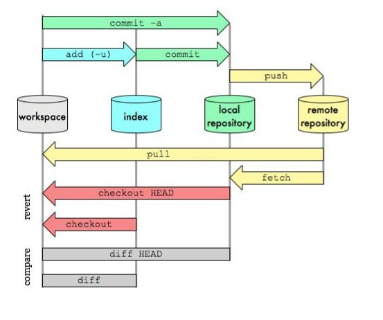

# Git

## 定义

Git是一款软件配置管理工具，或者说是一个版本控制系统，目的是管理代码的版本
- 其他的版本控制系统诸如CVS、Subversion、Perforce、Bazaar 等等都是保存文件的变更，即它们保存基本文件和每个文件随着时间逐步积累的差异
- Git是创建每次提交后全部文件的快照并保存这个快照的索引

## 特点

- 直接记录快照，而非差异比较
- 操作几乎都在本地执行
- git保证完整性：每次存储前都会计算所有数据的校验和，生成一个40位的字符串并根据校验和确保数据不被无意修改
- git一般只添加数据：几乎只对文件进行增加或者修改操作，而不是执行删除这种不可逆操作

## 工作流程

1. 在本地工作区修改文件
2. 将修改保存到暂存区
3. 提交修改，将暂存区的文件以快照的形式永久的存储到本地仓库目录
4. 将提交推送到远端仓库



## 常用命令

### git init

初始化git仓库

### git config

配置git

```
git config // 查看所有配置命令
git config -l // 查看所有配置
git config -e --global // 以vim编辑器编辑用户配置
git config --global alias.co 'checkout' // 设置别名
```

### git clone

将远程仓库克隆到本地，完整的命令如下

```
git clone <远程仓库网址> <本地目录>

-o 修改远程主机名，默认为origin
```

### git remote

管理远程主机名

```
git remote // 列出所有远程主机名

-v // 查看远程主机网址
show <主机名> // 查看主机详细信息
add <主机名> <主机网址> // 添加新的远程主机
rm <主机名> // 删除现有的某个远程主机
rename <原主机名> <新主机名> // 改名
```

### git status

展示工作区和暂存区文件的状态

```
git status -s // 展示简短信息
```

### git add

向暂存区添加文件

```
* // 添加所有文件，忽略.gitignore的限制
. // 添加删除文件之外的所有修改
-u // 添加已被git跟踪的文件，因此不包含新建文件
-A // 添加除.gitignore之外的所有修改
```

### git commit

提交修改到本地仓库

```
--amend // 追加修改到上一次提交
-m <描述> // 编辑提交信息
-a // 自动add除了新建文件之外的修改并提交
```

### git checkout

修改HEAD指针的指向，也就是切换分支

```
-b <新分支名> 创建一个新的分支并切换到该新分支
git checkout -- <文件名> 撤销工作区对该文件的修改
```

### git branch

管理分支

```
git branch // 查看本地分支
-a // 查看本地远程所有分支
-d <分支名> // 删除本地指定分支
-D <分支名> // 强制删除未合并的本地指定分支
-m <老分支名> <新分支名> // 重命名分支
-set-upstream <本地分支> <远程分支> // 设置追踪关系
```

### git fetch

将远端仓库的更新取回到本地仓库

```
git fetch <主机名> <分支名> // 取回指定分支的更新

-p/--prune // 拉取前删除不存在远端仓库的追踪分支
```

### git pull

将远端仓库某个分支的更新取回到本地仓库再合并到指定分支

```
git pull <主机名> <远程分支名>:<本地分支名>
```

实质上等价于`git fetch`和`git merge`

如果当前分支和需要更新的远程分支的同名，则可以省略本地分支名

```
git pull <主机名> <远程分支名>
```

如果本地的分支和远程分支存在追踪关系，则可以省略远程分支名

```
git pull <主机名>
```

如果当前分支只存在一个追踪分支，即只与一个远程主机中的分支建立追踪关系，则主机名也可以省略

```
git pull
```

默认`git pull`采用`merge`模式合并分支，如果我们要使用`rebase`模式，可指定子参数

```
git pull --rebase <主机名> <远程分支名>:<本地分支名>
```

### git push

将本地的修改推送到远程分支，命令类似`git pull`

```
git push <主机名> <本地分支名>:<远程分支名>
```

如果本地的该分支已经与远程分支建立了追踪关系，则可以省略远程分支名，如果远程不存在该分支，则会新建

```
git push <主机名> <本地分支名>
```

如果省略本地分支名，表示删除指定的远程分支，因为这相当于将一个空的分支推送到远程

```
git push <主机名> :<远程分支名>
```

其实如果存在追踪关系，且当前分支就是要推送的分支，则本地分支名也可以省略

```
git push <主机名>
```

如果推送的本地分支只存在一个追踪分支，则可以省略主机名

```
git push
```

如果推送的本地分支和远端多个主机存在追踪关系，则通过`-u`子参数指定默认主机，这样后面无需再指定主机名了

```
git push -u <主机名> <本地分支名>:<远程分支名>
```

其他命令

```
--all 推送本地所有分支到远端
--force 强制推送本地分支的更新到远端，该命令会忽视本地和远程的差异，强制推送本地更新
--tags 默认推送不会推送tag，使用该命令推送tag
```

### git rebase

合并分支的一种方法，我们来看看它和`merge`的差异

`merge`在比较本地分支和远程分支时，如果本地分支签出时的提交已经落后于远端，举个例子，我们在远程分支的c2提交签出开发分支experiment，
本地开发提交了c4，合并时拉取最新的远程分支，发现协作者已经提交了c3，这时不能直接的使用快进模式，而是要进行三方合并，生成一个新的合并提交c5，如果有冲突还要处理冲突，如图：


`rebase`在比较本地分支和远程分支时，如果本地分支签出时的提交已经落后于远端，举个例子，我们在远程分支的c2提交签出开发分支experiment，
本地开发提交了c4，合并时拉取最新的远程分支，发现协作者已经提交了c3，这时它会找到变基的两个分支的共同父提交c2，然后对比当前分支相对于c2的历次提交，提取相应的修改作为临时文件，
接着将当前分支指向远程分支的基底c3,最后把此前存的临时文件依次应用，感觉就像是把c4拼接到变基的分支后面一样，如图：


高阶用法

```
git rebase --onto <baseBranch> <compareBranch> <topicBranch>
```

上面命令的意思是取出topicBranch分支，找出与compareBranch分支分歧之后的提交，将其拼接到baseBranch分支之后，看起来就像是直接基于baseBranch修改的一样

```diff
- 如果提交存在于本地仓库之外，并且有人基于这些提交进行开发，那么不要执行变基
```

### git reset

版本回退，即可以回退到历史提交

```
--hard <commitID> // 回退到指定提交，工作区暂存区都没有修改文件
--soft <commitID> // 回退到指定提交，暂存区有修改文件，工作区没有修改文件
--mixed <commitID> // 默认参数，回退到指定提交，暂存区没有修改文件，工作区有修改文件

git reset HEAD <文件名> // 将指定文件从暂存区回退到工作区
```

### git revert

撤销指定的提交

```
git revert <commitID>..<commitID> // 撤销某次提交或一系列提交的修改并重新提交
-n // 不自动提交，而是将撤销文件回退到暂存区
-m <number> <commitID> // 对于合并提交，需要指定撤销哪个分支的提交，一般是1或2
```

### git cherry-pick

挑拣提交，将其他分支的某个提交引入当前分支，用法和`git revert`类似

```
git cherry-pick <commitID>..<commitID>
```

## 基于gitFlow的工作流

### 定义

- 主分支（master）：长期维护着对外发布的稳定版本，任何时候该分支上的代码都是稳定的
- 开发分支（develop）：长期的开发分支，存放最新的开发代码，一旦签出预发布分支就意味着一次发布周期的开始，在下一次发布周期开始前都不允许增加新功能，而只允许进行修补的工作
- 功能分支（feature）：新特性的开发分支，可发布多人协同开发，由开发分支签出
- 补丁分支（hotfix）：bug修复分支，用于紧急修复BUG，从主分支中签出，bug修复后合入主分支和开发分支
- 预发布分支（release）：一旦新功能开发接近尾声，就从开发分支签出预发布分支用于进行发布前的一些bug修复，文档编写工作

### 流程

 1. 首先本地根据主分支签出开发分支，推送到远端作为日常维护的开发分支
 2. 新功能开发时，从开发分支签出功能分支，可发布到线上多人协同开发
 3. 功能开发完毕后，合入开发分支，删除该功能分支，并从开发分支中签出预发布分支
 4. 完成功能发布前的收尾工作后，将预发布分支分别合入主分支和开发分支
 5. 功能上线后删除该预发布分支，如果线上出现问题，从主分支上签出补丁分支
 6. 问题修复后，合入主分支和开发分支，删除补丁分支
