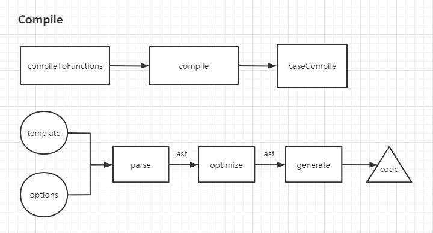

# 编译

## 前置正则知识

### 捕获组

使用`()`可以在正则表达式内部定义分组，分组的作用是在整体匹配成功的前提下抽出我们需要的局部数据，比如`2010-10-01`这个日期中的年份

#### 捕获组编号命名

默认情况，正则中有几个左括号就意味着有几个分组，但是要除去下面几种情况
- 转义后的(，比如`\(`
- 非捕获分组，即括号内部以`?`开头的分组，这种分组不会出现在匹配结果中
- 中括号内的(，比如`[(]`，实际上也算转义了(

如果没有显式的指定捕获组的名称，即没有使用命名捕获组，那么就需要按数字顺序来访问所有捕获组，只有普通捕获组的情况，编号按照(出现的顺序，从左到右，从1开始编号

命名捕获组经过显式命名`(?<name>\d{4})`，就可以通过组名方便的访问，不需要去数编号，但其实命名捕获组也参与了编号的，在只有命名捕获组的情况下，与普通捕获组的编号规则一致

混合了普通分组和命名分组的编号规则是先忽略命名分组，等到普通分组编号完成后再从头对命名分组编号，比如
```
(\d{4})-(?<date>\d{2})-(\d\d)

|---1---|-----3------|---2----|
```

#### 捕获组引用

捕获组捕获到的内容，不仅可以在正则表达式外部通过程序引用，也可以在正则表达式内部进行引用，这被称为反向引用

普通捕获组的反向引用采用`\k<number>`格式，通常简写为`\number`

反向引用使用`\k<name>`，通常简写为`\k'name'`

#### 非捕获组

以`?`开头的都是非捕获组，不捕获文本，不参与捕获组的编号，也无法进行反向引用，常见的非捕获组有

- (?:pattern)，匹配pattern，但不捕获匹配结果
- (?=pattern)，零宽度正向预查，但不捕获匹配结果
- (?!pattern)，零宽度负向预查，但不捕获匹配结果
- (?<=pattern)，零宽度正向回查，但不捕获匹配结果
- (?<!pattern)，零宽度负向回查，但不捕获匹配结果

上面四种情况的例子
```
// 匹配includes或者includer
/include(?:s|r)/

// 匹配Windows2000、Windows95、Windows98、WindowsNT，不匹配Windows3.1
/Windows(?=95|98|NT|2000)/

// 不匹配Windows2000、Windows95、Windows98、WindowsNT，匹配Windows3.1
/Windows(?!95|98|NT|2000)/ 

// 匹配Office2000、Word2000、Excel2000，不匹配Windows2000
/2000(?<=Office|Word|Excel)/ 

// 不匹配Office2000、Word2000、Excel2000，匹配Windows2000
/2000(?<!Office|Word|Excel)/ 

```

#### 正则在字符串方法中的使用

字符串有match方法，该方法接收一个正则表达式对象，返回一个数组
```
0-n: 数组的前n个元素对应完全匹配结果和后续的所有分组捕获结果
groups: 如果定义了命名捕获组，则会以命名为键，捕获结果为值，返回键值对对象
index: 匹配结果在匹配字符串中的开始位置
input: 输入字符串
```

## 编译实现中的函数柯里化



上面是编译函数的调用图，下面是实际编译的流程图

我们来理一下为什么要柯里化，我们的目的是接收template和options，生成code，但是我们需要传入一些基本配置baseOptions，所以我们可以得到
```
compile = createCompile(baseOptions)
code = compile(template, options)
```

但是我们希望把合并配置和真正的编译区分开来，所以我们定义一个baseCompile函数处理核心编译过程，而compile函数负责合并配置
```
compile = createCompilerCreator(baseCompile)
```

这样我们就能在baseCompile中实现核心逻辑，并在createCompilerCreator函数中封装合并配置的compile函数

我们还希望能够对编译出来的code进行一些判断，加一些缓存，所以我们定义一个compileToFunctions函数
```
compileToFunctions = createCompileToFunctionFn(compile)
```

这样我们就可以在createCompileToFunctionFn函数中取得compile编译的code，然后封装对code的处理，最后返回结果

## 模板转AST

AST又叫抽象语法树，在Vue中实质上是把template字符串或HTML转化为JS对象，内部包含了所有节点的信息

### 大致流程

我们得到template字符串后，通过parse方法解析得到ast，parse内部实际上是通过parseHTML方法完成的转化，parseHTML接受template字符串和parse配置，其中就包含了start、end、chars、comment四个钩子函数，分别在解析字符串的各个阶段执行

parseHTML方法Vue借鉴了jquery作者的代码并在其基础上进行开发，parseHTML方法主要是利用正则匹配出开始标签、结束标签、注释节点、DOCTYPE标签，直到传入的html为空为止

- 匹配到开始标签时，会收集其tag名，获取标签上的属性列表并进行相应的格式化，接着触发start钩子，创建一个ast节点，并在钩子中处理一些常用指令（v-if、v-for、v-once）
- 匹配下一个<的位置不是0代表中间有文本，这个时候会判断当次匹配的<是否是文本内容并通过循环找出真正的边界，接着触发chars钩子进入文本的处理，处理文本主要有两类，一类是表达式，表达式类型会通过正则匹配处理成后面要用到的格式如：`'_s(item)+";>"+_s(index)'`，并创建一个表达式ast节点；另一类是纯文本，它直接创建一个文本ast节点
- 匹配到结束标签时，主要工作是判断标签是否正常闭合，不正常则报错，最后触发end钩子，end钩子的closeElement方法首先处理了元素的key、ref、slot、is、类、样式、事件绑定等其他属性，最后建立了ast节点之间的父子关系
- 匹配到注释节点就创建一个ast注释节点

parseHTML方法通过逐个解析，最终生成了完整的ast树

判断标签是否正常闭合主要是通过栈来实现的，如果遇到一个标签是非自闭合标签，就推入栈中，在遇到结束标签时，从栈末尾开始匹配

- 如果栈末尾恰好是当前结束标签，说明书写规范正常
- 如果在栈中找到开始标签，说明该位置到栈尾这些标签没有正常闭合，报错
- 如果无法在栈中找到，说明当前结束标签只有结束标签而无开始标签，这时会对`br`和`p`两个标签进行处理，为其手动添加开始标签，其他标签忽略

此外，在解析时，Vue严格遵循W3C的html解析规范，对于非phrasingTag（能放在p标签内部构成段落的元素，如span），发现其在p标签内部时，手动闭合p标签；发现能自动补全闭标签的元素时，也手动闭合

在整个模板解析过程维护两个栈，一个栈在解析字符串时用来判断标签是否正常闭合，另一个栈用来保存创建的ast节点以便创建整个ast树

## 静态节点优化

## AST转可执行代码